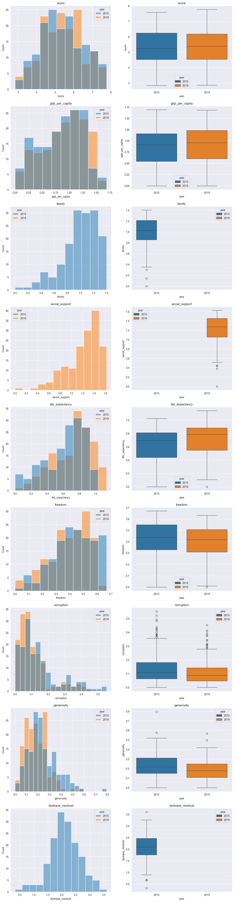
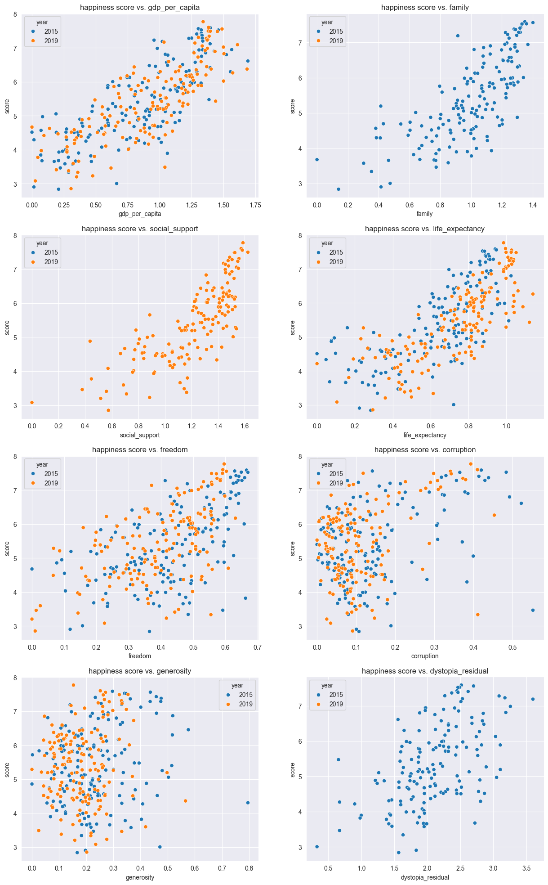
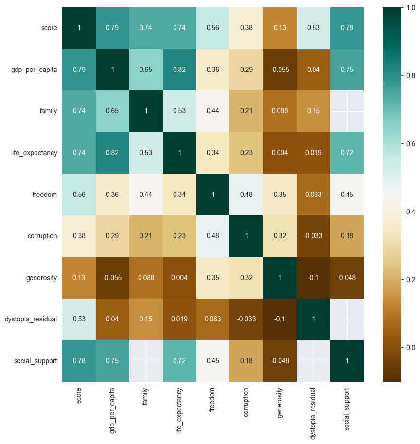
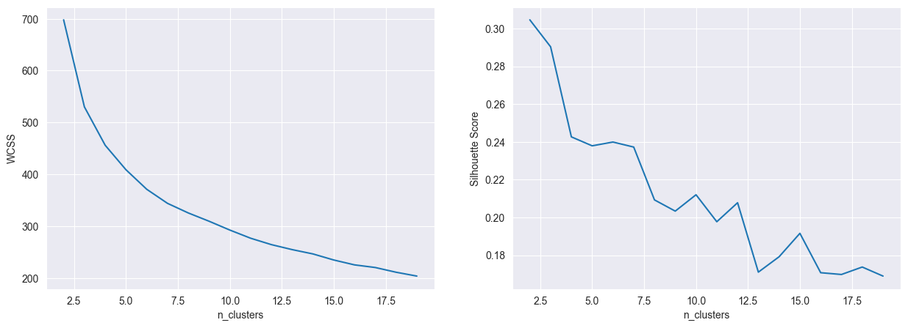
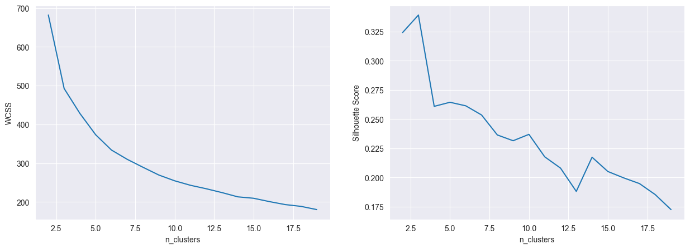
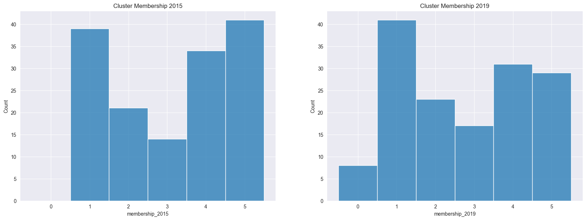
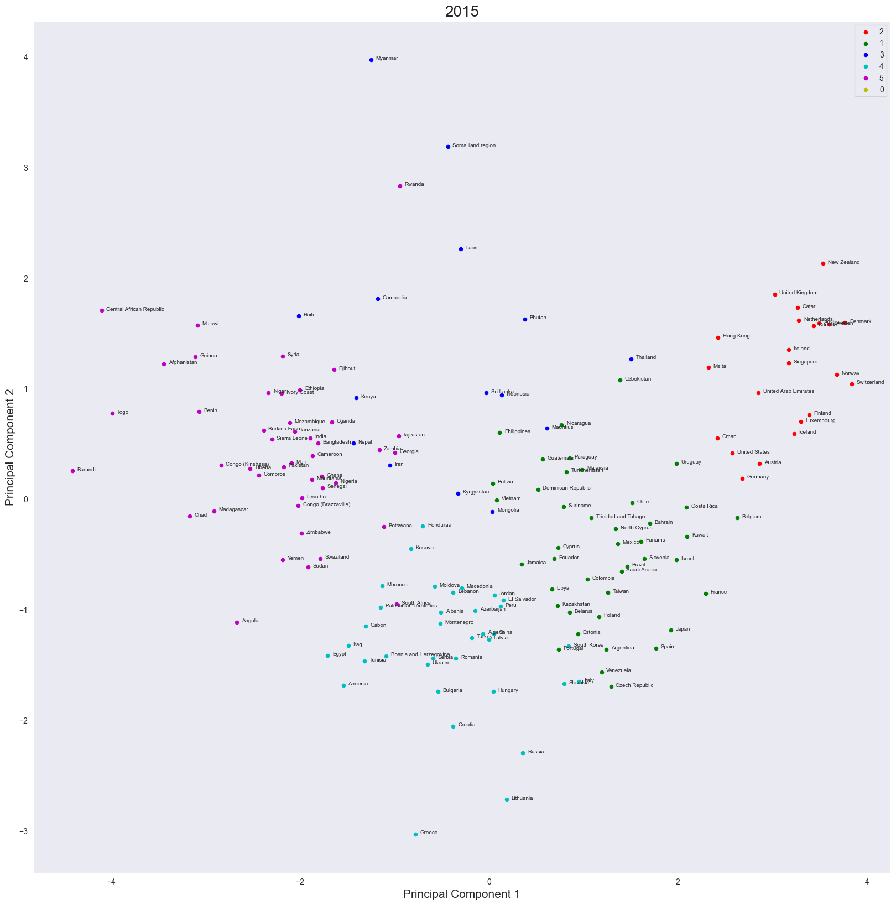
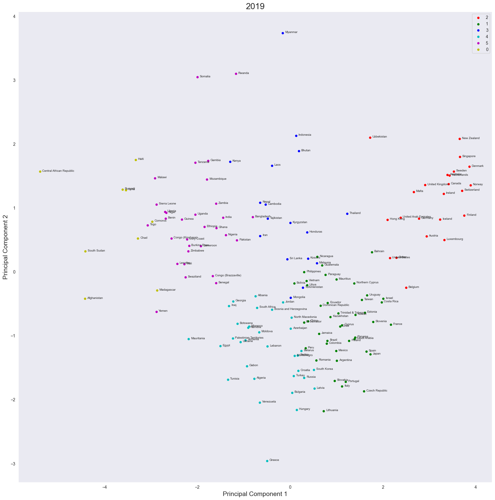
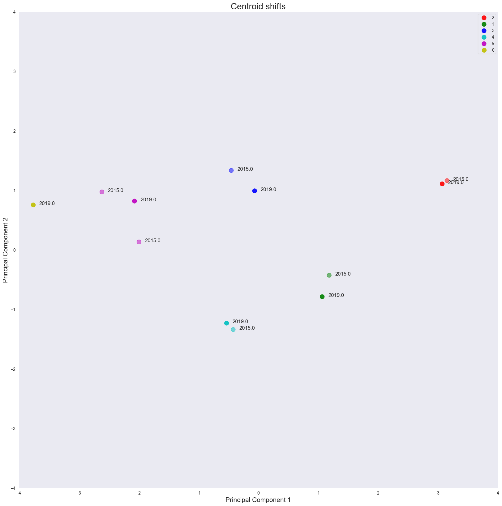
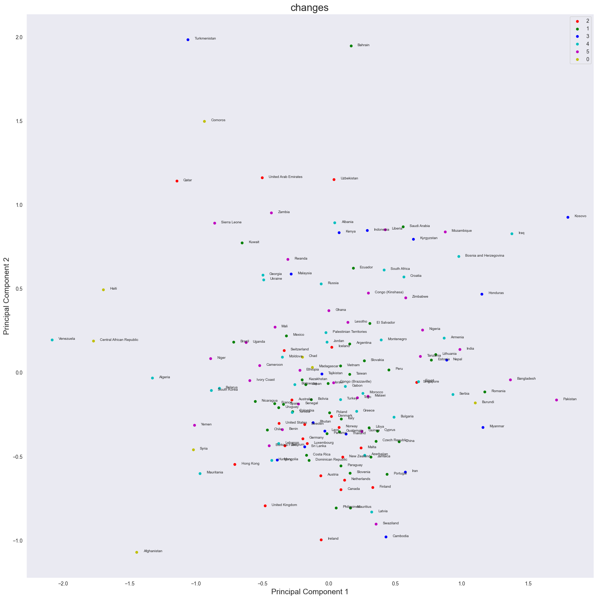

# CMM704 - Data Mining
## Question 2: Clustering
Author: Kaneel Dias

Last modified: 2025-04-12

[Source code](https://github.com/kaneeldias/country-happiness-scores)

## Task
Using the two provided datasets, perform the following tasks:
- Perform exploratory data analysis (EDA) on the datasets.
- Outlier detection and removal.
- Feature scaling and transformation.
- Clustering model development
- Cluster evaluation
- Model drift analysis
- Visualization of the results 


```python
import pandas as pd
import numpy as np
import matplotlib.pyplot as plt
import seaborn as sns
from sklearn.cluster import KMeans
from sklearn.metrics import silhouette_score
from scipy.spatial.distance import cdist
from scipy.stats import entropy
from sklearn.decomposition import PCA
```

## Exploratory Data Analysis (EDA)


```python
data_2015 = pd.read_csv("data/2015.csv")
data_2019 = pd.read_csv("data/2019.csv")
```


```python
data_2015.head()
```


<div>
<style scoped>
    .dataframe tbody tr th:only-of-type {
        vertical-align: middle;
    }

    .dataframe tbody tr th {
        vertical-align: top;
    }

    .dataframe thead th {
        text-align: right;
    }
</style>
<table border="1" class="dataframe">
  <thead>
    <tr style="text-align: right;">
      <th></th>
      <th>Country</th>
      <th>Region</th>
      <th>Happiness Rank</th>
      <th>Happiness Score</th>
      <th>Standard Error</th>
      <th>Economy (GDP per Capita)</th>
      <th>Family</th>
      <th>Health (Life Expectancy)</th>
      <th>Freedom</th>
      <th>Trust (Government Corruption)</th>
      <th>Generosity</th>
      <th>Dystopia Residual</th>
    </tr>
  </thead>
  <tbody>
    <tr>
      <th>0</th>
      <td>Switzerland</td>
      <td>Western Europe</td>
      <td>1</td>
      <td>7.587</td>
      <td>0.03411</td>
      <td>1.39651</td>
      <td>1.34951</td>
      <td>0.94143</td>
      <td>0.66557</td>
      <td>0.41978</td>
      <td>0.29678</td>
      <td>2.51738</td>
    </tr>
    <tr>
      <th>1</th>
      <td>Iceland</td>
      <td>Western Europe</td>
      <td>2</td>
      <td>7.561</td>
      <td>0.04884</td>
      <td>1.30232</td>
      <td>1.40223</td>
      <td>0.94784</td>
      <td>0.62877</td>
      <td>0.14145</td>
      <td>0.43630</td>
      <td>2.70201</td>
    </tr>
    <tr>
      <th>2</th>
      <td>Denmark</td>
      <td>Western Europe</td>
      <td>3</td>
      <td>7.527</td>
      <td>0.03328</td>
      <td>1.32548</td>
      <td>1.36058</td>
      <td>0.87464</td>
      <td>0.64938</td>
      <td>0.48357</td>
      <td>0.34139</td>
      <td>2.49204</td>
    </tr>
    <tr>
      <th>3</th>
      <td>Norway</td>
      <td>Western Europe</td>
      <td>4</td>
      <td>7.522</td>
      <td>0.03880</td>
      <td>1.45900</td>
      <td>1.33095</td>
      <td>0.88521</td>
      <td>0.66973</td>
      <td>0.36503</td>
      <td>0.34699</td>
      <td>2.46531</td>
    </tr>
    <tr>
      <th>4</th>
      <td>Canada</td>
      <td>North America</td>
      <td>5</td>
      <td>7.427</td>
      <td>0.03553</td>
      <td>1.32629</td>
      <td>1.32261</td>
      <td>0.90563</td>
      <td>0.63297</td>
      <td>0.32957</td>
      <td>0.45811</td>
      <td>2.45176</td>
    </tr>
  </tbody>
</table>
</div>


```python
data_2019.head()
```


<div>
<style scoped>
    .dataframe tbody tr th:only-of-type {
        vertical-align: middle;
    }

    .dataframe tbody tr th {
        vertical-align: top;
    }

    .dataframe thead th {
        text-align: right;
    }
</style>
<table border="1" class="dataframe">
  <thead>
    <tr style="text-align: right;">
      <th></th>
      <th>Overall rank</th>
      <th>Country or region</th>
      <th>Score</th>
      <th>GDP per capita</th>
      <th>Social support</th>
      <th>Healthy life expectancy</th>
      <th>Freedom to make life choices</th>
      <th>Generosity</th>
      <th>Perceptions of corruption</th>
    </tr>
  </thead>
  <tbody>
    <tr>
      <th>0</th>
      <td>1</td>
      <td>Finland</td>
      <td>7.769</td>
      <td>1.340</td>
      <td>1.587</td>
      <td>0.986</td>
      <td>0.596</td>
      <td>0.153</td>
      <td>0.393</td>
    </tr>
    <tr>
      <th>1</th>
      <td>2</td>
      <td>Denmark</td>
      <td>7.600</td>
      <td>1.383</td>
      <td>1.573</td>
      <td>0.996</td>
      <td>0.592</td>
      <td>0.252</td>
      <td>0.410</td>
    </tr>
    <tr>
      <th>2</th>
      <td>3</td>
      <td>Norway</td>
      <td>7.554</td>
      <td>1.488</td>
      <td>1.582</td>
      <td>1.028</td>
      <td>0.603</td>
      <td>0.271</td>
      <td>0.341</td>
    </tr>
    <tr>
      <th>3</th>
      <td>4</td>
      <td>Iceland</td>
      <td>7.494</td>
      <td>1.380</td>
      <td>1.624</td>
      <td>1.026</td>
      <td>0.591</td>
      <td>0.354</td>
      <td>0.118</td>
    </tr>
    <tr>
      <th>4</th>
      <td>5</td>
      <td>Netherlands</td>
      <td>7.488</td>
      <td>1.396</td>
      <td>1.522</td>
      <td>0.999</td>
      <td>0.557</td>
      <td>0.322</td>
      <td>0.298</td>
    </tr>
  </tbody>
</table>
</div>


Here we can see two datasets with different socio-economic indicators for different countries in 2015 and 2019. The datasets contain the following columns:
|   Field Name   | Description                          |  Present in 2015? | Present in 2019?  |
|----------------|--------------------------------------|-------------------|-------------------|
| Country        | Country name                         | Yes               | Yes               |
| Happiness Rank | Rank of happiness score              | Yes               | Yes               |
| Happiness Score| Happiness score                      | Yes               | Yes               |
| Standard Error | Standard error of happiness score    | Yes               | No                |
| Economy        | GDP per capita adjusted for PP       | Yes               | Yes               |
| Family         | Familial support                     | Yes               | No                |
| Life expectancy| Life expectancy                      | Yes               | Yes               |
| Freedom        | Freedom to make life choices         | Yes               | Yes               |
| Generosity     | Generosity score                     | Yes               | Yes               |
| Trust          | Trust in government                  | Yes               | No                |
| Dystopia       | Dystopia residual                    | Yes               | No                |
| Social Support | Social support                       | No                | Yes               |


We can see that there are several columns which have different names, but most likely track the same underlying metric. In order to make our working data more consistent and easier to work with, we will map the columns to a common set of names. We will also drop the columns that are not present in both datasets, as they will not be useful for our analysis.


```python
def map_columns(df, column_mapping):
    res = pd.DataFrame([])
    for key, val in column_mapping.items():
        res[key] = df[val]
    
    return res
```


```python
column_mapping_2015 = {
    "country": "Country",
    "score": "Happiness Score",
    "gdp_per_capita": "Economy (GDP per Capita)",
    "family": "Family",
    "life_expectancy": "Health (Life Expectancy)",
    "freedom": "Freedom",
    "corruption": "Trust (Government Corruption)",
    "generosity": "Generosity",
    "dystopia_residual": "Dystopia Residual"
}

data_2015 = map_columns(data_2015, column_mapping_2015)
data_2015.head()
```


<div>
<style scoped>
    .dataframe tbody tr th:only-of-type {
        vertical-align: middle;
    }

    .dataframe tbody tr th {
        vertical-align: top;
    }

    .dataframe thead th {
        text-align: right;
    }
</style>
<table border="1" class="dataframe">
  <thead>
    <tr style="text-align: right;">
      <th></th>
      <th>country</th>
      <th>score</th>
      <th>gdp_per_capita</th>
      <th>family</th>
      <th>life_expectancy</th>
      <th>freedom</th>
      <th>corruption</th>
      <th>generosity</th>
      <th>dystopia_residual</th>
    </tr>
  </thead>
  <tbody>
    <tr>
      <th>0</th>
      <td>Switzerland</td>
      <td>7.587</td>
      <td>1.39651</td>
      <td>1.34951</td>
      <td>0.94143</td>
      <td>0.66557</td>
      <td>0.41978</td>
      <td>0.29678</td>
      <td>2.51738</td>
    </tr>
    <tr>
      <th>1</th>
      <td>Iceland</td>
      <td>7.561</td>
      <td>1.30232</td>
      <td>1.40223</td>
      <td>0.94784</td>
      <td>0.62877</td>
      <td>0.14145</td>
      <td>0.43630</td>
      <td>2.70201</td>
    </tr>
    <tr>
      <th>2</th>
      <td>Denmark</td>
      <td>7.527</td>
      <td>1.32548</td>
      <td>1.36058</td>
      <td>0.87464</td>
      <td>0.64938</td>
      <td>0.48357</td>
      <td>0.34139</td>
      <td>2.49204</td>
    </tr>
    <tr>
      <th>3</th>
      <td>Norway</td>
      <td>7.522</td>
      <td>1.45900</td>
      <td>1.33095</td>
      <td>0.88521</td>
      <td>0.66973</td>
      <td>0.36503</td>
      <td>0.34699</td>
      <td>2.46531</td>
    </tr>
    <tr>
      <th>4</th>
      <td>Canada</td>
      <td>7.427</td>
      <td>1.32629</td>
      <td>1.32261</td>
      <td>0.90563</td>
      <td>0.63297</td>
      <td>0.32957</td>
      <td>0.45811</td>
      <td>2.45176</td>
    </tr>
  </tbody>
</table>
</div>


```python
column_mapping_2019 = {
    "country": "Country or region",
    "score": "Score",
    "gdp_per_capita": "GDP per capita",
    "social_support": "Social support",
    "life_expectancy": "Healthy life expectancy",
    "freedom": "Freedom to make life choices",
    "corruption": "Perceptions of corruption",
    "generosity": "Generosity",
}

data_2019 = map_columns(data_2019, column_mapping_2019)
data_2019.head()
```


<div>
<style scoped>
    .dataframe tbody tr th:only-of-type {
        vertical-align: middle;
    }

    .dataframe tbody tr th {
        vertical-align: top;
    }

    .dataframe thead th {
        text-align: right;
    }
</style>
<table border="1" class="dataframe">
  <thead>
    <tr style="text-align: right;">
      <th></th>
      <th>country</th>
      <th>score</th>
      <th>gdp_per_capita</th>
      <th>social_support</th>
      <th>life_expectancy</th>
      <th>freedom</th>
      <th>corruption</th>
      <th>generosity</th>
    </tr>
  </thead>
  <tbody>
    <tr>
      <th>0</th>
      <td>Finland</td>
      <td>7.769</td>
      <td>1.340</td>
      <td>1.587</td>
      <td>0.986</td>
      <td>0.596</td>
      <td>0.393</td>
      <td>0.153</td>
    </tr>
    <tr>
      <th>1</th>
      <td>Denmark</td>
      <td>7.600</td>
      <td>1.383</td>
      <td>1.573</td>
      <td>0.996</td>
      <td>0.592</td>
      <td>0.410</td>
      <td>0.252</td>
    </tr>
    <tr>
      <th>2</th>
      <td>Norway</td>
      <td>7.554</td>
      <td>1.488</td>
      <td>1.582</td>
      <td>1.028</td>
      <td>0.603</td>
      <td>0.341</td>
      <td>0.271</td>
    </tr>
    <tr>
      <th>3</th>
      <td>Iceland</td>
      <td>7.494</td>
      <td>1.380</td>
      <td>1.624</td>
      <td>1.026</td>
      <td>0.591</td>
      <td>0.118</td>
      <td>0.354</td>
    </tr>
    <tr>
      <th>4</th>
      <td>Netherlands</td>
      <td>7.488</td>
      <td>1.396</td>
      <td>1.522</td>
      <td>0.999</td>
      <td>0.557</td>
      <td>0.298</td>
      <td>0.322</td>
    </tr>
  </tbody>
</table>
</div>


Next, we merge the two datasets into a single dataset. We will also add a column to indicate the year of the data, so that we can easily filter the data later on.


```python
data_2015["year"] = 2015
data_2019["year"] = 2019

print(f"Shape of 2015: {data_2015.shape}")
print(f"Shape of 2019: {data_2019.shape}")

data_merged = pd.concat([data_2015, data_2019])
print(f"Shape of merged: {data_merged.shape}")

data_merged = data_merged.replace(np.nan, None)

data_merged.head()
```

    Shape of 2015: (158, 10)
    Shape of 2019: (156, 9)
    Shape of merged: (314, 11)
    


<div>
<style scoped>
    .dataframe tbody tr th:only-of-type {
        vertical-align: middle;
    }

    .dataframe tbody tr th {
        vertical-align: top;
    }

    .dataframe thead th {
        text-align: right;
    }
</style>
<table border="1" class="dataframe">
  <thead>
    <tr style="text-align: right;">
      <th></th>
      <th>country</th>
      <th>score</th>
      <th>gdp_per_capita</th>
      <th>family</th>
      <th>life_expectancy</th>
      <th>freedom</th>
      <th>corruption</th>
      <th>generosity</th>
      <th>dystopia_residual</th>
      <th>year</th>
      <th>social_support</th>
    </tr>
  </thead>
  <tbody>
    <tr>
      <th>0</th>
      <td>Switzerland</td>
      <td>7.587</td>
      <td>1.39651</td>
      <td>1.34951</td>
      <td>0.94143</td>
      <td>0.66557</td>
      <td>0.41978</td>
      <td>0.29678</td>
      <td>2.51738</td>
      <td>2015</td>
      <td>None</td>
    </tr>
    <tr>
      <th>1</th>
      <td>Iceland</td>
      <td>7.561</td>
      <td>1.30232</td>
      <td>1.40223</td>
      <td>0.94784</td>
      <td>0.62877</td>
      <td>0.14145</td>
      <td>0.43630</td>
      <td>2.70201</td>
      <td>2015</td>
      <td>None</td>
    </tr>
    <tr>
      <th>2</th>
      <td>Denmark</td>
      <td>7.527</td>
      <td>1.32548</td>
      <td>1.36058</td>
      <td>0.87464</td>
      <td>0.64938</td>
      <td>0.48357</td>
      <td>0.34139</td>
      <td>2.49204</td>
      <td>2015</td>
      <td>None</td>
    </tr>
    <tr>
      <th>3</th>
      <td>Norway</td>
      <td>7.522</td>
      <td>1.45900</td>
      <td>1.33095</td>
      <td>0.88521</td>
      <td>0.66973</td>
      <td>0.36503</td>
      <td>0.34699</td>
      <td>2.46531</td>
      <td>2015</td>
      <td>None</td>
    </tr>
    <tr>
      <th>4</th>
      <td>Canada</td>
      <td>7.427</td>
      <td>1.32629</td>
      <td>1.32261</td>
      <td>0.90563</td>
      <td>0.63297</td>
      <td>0.32957</td>
      <td>0.45811</td>
      <td>2.45176</td>
      <td>2015</td>
      <td>None</td>
    </tr>
  </tbody>
</table>
</div>


Now we check for any missing values in the merged dataset. We can see that there are some missing values in the `family` and `trust` columns, which we will need to handle later on. We will also check the data types of the columns to make sure they are correct.


```python
data_merged.isnull().sum()
```


    country                0
    score                  0
    gdp_per_capita         0
    family               156
    life_expectancy        0
    freedom                0
    corruption             0
    generosity             0
    dystopia_residual    156
    year                   0
    social_support       158
    dtype: int64


We can also check the data types of the columns to make sure they are correct. We can see that the `year` column is currently an integer, but we will convert it to a categorical variable later on.


```python
data_merged.dtypes
```


    country               object
    score                float64
    gdp_per_capita       float64
    family                object
    life_expectancy      float64
    freedom              float64
    corruption           float64
    generosity           float64
    dystopia_residual     object
    year                   int64
    social_support        object
    dtype: object


```python
data_merged['year'] = data_merged.year.astype("category")
data_merged.dtypes
```


    country                object
    score                 float64
    gdp_per_capita        float64
    family                 object
    life_expectancy       float64
    freedom               float64
    corruption            float64
    generosity            float64
    dystopia_residual      object
    year                 category
    social_support         object
    dtype: object


Now we can plot the distributions of the different features in the dataset. We will use histograms and box plots to visualize the distributions of the different features. We will also use a scatter plot to visualize the relationship between the happiness score and the different features.


```python
def box_plot_distributions(df):
    column_names = ["score", "gdp_per_capita", "family", "social_support", "life_expectancy", "freedom", "corruption", "generosity", "dystopia_residual"]
        
    plt.figure(figsize=(15, 60))
    
    for idx, feature in enumerate(column_names, 1):
        plt.subplot(len(column_names), 2, 2*idx-1)
        sns.histplot(data=df[df[feature].notnull()], x=feature, hue="year")
        plt.title(f"{feature}")
        
        plt.subplot(len(column_names), 2, 2*idx)
        sns.boxplot(data=df[df[feature].notnull()], x="year", y=feature, hue="year")
        plt.title(f"{feature}")
        
    plt.show()
```


```python
box_plot_distributions(data_merged)
```


    

    


We can also summarize the data by grouping it by year and calculating the mean and standard deviation of the different features. This will give us an idea of how the different features have changed over time.


```python
def summarize_data(df):
    column_names = ["score", "gdp_per_capita", "family", "social_support", "life_expectancy", "freedom", "corruption", "generosity", "dystopia_residual"]
    
    for column_name in column_names:
        print(f"Summary of {column_name}")
        print(df.groupby("year", observed=False)[column_name].describe())
        print("\n")
```


```python
summarize_data(data_merged)
```

    Summary of score
          count      mean      std    min     25%     50%      75%    max
    year                                                                 
    2015  158.0  5.375734  1.14501  2.839  4.5260  5.2325  6.24375  7.587
    2019  156.0  5.407096  1.11312  2.853  4.5445  5.3795  6.18450  7.769
    
    
    Summary of gdp_per_capita
          count      mean       std  min       25%       50%       75%      max
    year                                                                       
    2015  158.0  0.846137  0.403121  0.0  0.545808  0.910245  1.158448  1.69042
    2019  156.0  0.905147  0.398389  0.0  0.602750  0.960000  1.232500  1.68400
    
    
    Summary of family
          count unique      top freq
    year                            
    2015  158.0  158.0  1.34951  1.0
    2019      0      0      NaN  NaN
    
    
    Summary of social_support
          count unique    top freq
    year                          
    2015      0      0    NaN  NaN
    2019  156.0  145.0  1.465  3.0
    
    
    Summary of life_expectancy
          count      mean       std  min       25%       50%       75%      max
    year                                                                       
    2015  158.0  0.630259  0.247078  0.0  0.439185  0.696705  0.811013  1.02525
    2019  156.0  0.725244  0.242124  0.0  0.547750  0.789000  0.881750  1.14100
    
    
    Summary of freedom
          count      mean       std  min      25%       50%       75%      max
    year                                                                      
    2015  158.0  0.428615  0.150693  0.0  0.32833  0.435515  0.549092  0.66973
    2019  156.0  0.392571  0.143289  0.0  0.30800  0.417000  0.507250  0.63100
    
    
    Summary of corruption
          count      mean       std  min       25%      50%       75%      max
    year                                                                      
    2015  158.0  0.143422  0.120034  0.0  0.061675  0.10722  0.180255  0.55191
    2019  156.0  0.110603  0.094538  0.0  0.047000  0.08550  0.141250  0.45300
    
    
    Summary of generosity
          count      mean       std  min       25%      50%       75%      max
    year                                                                      
    2015  158.0  0.237296  0.126685  0.0  0.150553  0.21613  0.309883  0.79588
    2019  156.0  0.184846  0.095254  0.0  0.108750  0.17750  0.248250  0.56600
    
    
    Summary of dystopia_residual
          count unique      top freq
    year                            
    2015  158.0  158.0  2.51738  1.0
    2019      0      0      NaN  NaN
    
    
    

Now using a scatter plot, we can visualize the relationship between the happiness score and the different features. We will also use a scatter plot to visualize the relationship between the different features and the happiness score.


```python
def scatter_plot(df):
    column_names = ["gdp_per_capita", "family", "social_support", "life_expectancy", "freedom", "corruption",
                    "generosity", "dystopia_residual"]

    plt.figure(figsize=(15, 50))
    
    for idx, feature in enumerate(column_names, 1):
        plt.subplot(len(column_names), 2, idx)
        sns.scatterplot(data=df[df[feature].notnull()], x=feature, y="score", hue="year")
        plt.title(f"happiness score vs. {feature}")
    
    plt.show()
```


```python
scatter_plot(data_merged)
```


    

    


Now, we can plot the correlation matrix to see how the different features are correlated with each other. We will also use a heatmap to visualize the correlation matrix.


```python
plt.figure(figsize = (10,10))
c= data_merged.drop(["country", "year"], axis=1).corr()
sns.heatmap(c, cmap="BrBG", annot=True)

c
```


<div>
<style scoped>
    .dataframe tbody tr th:only-of-type {
        vertical-align: middle;
    }

    .dataframe tbody tr th {
        vertical-align: top;
    }

    .dataframe thead th {
        text-align: right;
    }
</style>
<table border="1" class="dataframe">
  <thead>
    <tr style="text-align: right;">
      <th></th>
      <th>score</th>
      <th>gdp_per_capita</th>
      <th>family</th>
      <th>life_expectancy</th>
      <th>freedom</th>
      <th>corruption</th>
      <th>generosity</th>
      <th>dystopia_residual</th>
      <th>social_support</th>
    </tr>
  </thead>
  <tbody>
    <tr>
      <th>score</th>
      <td>1.000000</td>
      <td>0.786038</td>
      <td>0.740605</td>
      <td>0.739920</td>
      <td>0.561481</td>
      <td>0.382392</td>
      <td>0.128658</td>
      <td>0.530474</td>
      <td>0.777058</td>
    </tr>
    <tr>
      <th>gdp_per_capita</th>
      <td>0.786038</td>
      <td>1.000000</td>
      <td>0.645299</td>
      <td>0.822400</td>
      <td>0.361661</td>
      <td>0.286737</td>
      <td>-0.055060</td>
      <td>0.040059</td>
      <td>0.754906</td>
    </tr>
    <tr>
      <th>family</th>
      <td>0.740605</td>
      <td>0.645299</td>
      <td>1.000000</td>
      <td>0.531104</td>
      <td>0.441518</td>
      <td>0.205605</td>
      <td>0.087513</td>
      <td>0.148117</td>
      <td>NaN</td>
    </tr>
    <tr>
      <th>life_expectancy</th>
      <td>0.739920</td>
      <td>0.822400</td>
      <td>0.531104</td>
      <td>1.000000</td>
      <td>0.341783</td>
      <td>0.230385</td>
      <td>0.003999</td>
      <td>0.018979</td>
      <td>0.719009</td>
    </tr>
    <tr>
      <th>freedom</th>
      <td>0.561481</td>
      <td>0.361661</td>
      <td>0.441518</td>
      <td>0.341783</td>
      <td>1.000000</td>
      <td>0.477820</td>
      <td>0.345400</td>
      <td>0.062783</td>
      <td>0.447333</td>
    </tr>
    <tr>
      <th>corruption</th>
      <td>0.382392</td>
      <td>0.286737</td>
      <td>0.205605</td>
      <td>0.230385</td>
      <td>0.477820</td>
      <td>1.000000</td>
      <td>0.317965</td>
      <td>-0.033105</td>
      <td>0.181899</td>
    </tr>
    <tr>
      <th>generosity</th>
      <td>0.128658</td>
      <td>-0.055060</td>
      <td>0.087513</td>
      <td>0.003999</td>
      <td>0.345400</td>
      <td>0.317965</td>
      <td>1.000000</td>
      <td>-0.101301</td>
      <td>-0.048126</td>
    </tr>
    <tr>
      <th>dystopia_residual</th>
      <td>0.530474</td>
      <td>0.040059</td>
      <td>0.148117</td>
      <td>0.018979</td>
      <td>0.062783</td>
      <td>-0.033105</td>
      <td>-0.101301</td>
      <td>1.000000</td>
      <td>NaN</td>
    </tr>
    <tr>
      <th>social_support</th>
      <td>0.777058</td>
      <td>0.754906</td>
      <td>NaN</td>
      <td>0.719009</td>
      <td>0.447333</td>
      <td>0.181899</td>
      <td>-0.048126</td>
      <td>NaN</td>
      <td>1.000000</td>
    </tr>
  </tbody>
</table>
</div>


    

    


We can now save the merged dataset to a CSV file for later use.


```python
data_merged.to_csv("data/combined.csv", index=False)
```

## Pre-processing


```python
data = pd.read_csv("data/combined.csv")
data.head()
```


<div>
<style scoped>
    .dataframe tbody tr th:only-of-type {
        vertical-align: middle;
    }

    .dataframe tbody tr th {
        vertical-align: top;
    }

    .dataframe thead th {
        text-align: right;
    }
</style>
<table border="1" class="dataframe">
  <thead>
    <tr style="text-align: right;">
      <th></th>
      <th>country</th>
      <th>score</th>
      <th>gdp_per_capita</th>
      <th>family</th>
      <th>life_expectancy</th>
      <th>freedom</th>
      <th>corruption</th>
      <th>generosity</th>
      <th>dystopia_residual</th>
      <th>year</th>
      <th>social_support</th>
    </tr>
  </thead>
  <tbody>
    <tr>
      <th>0</th>
      <td>Switzerland</td>
      <td>7.587</td>
      <td>1.39651</td>
      <td>1.34951</td>
      <td>0.94143</td>
      <td>0.66557</td>
      <td>0.41978</td>
      <td>0.29678</td>
      <td>2.51738</td>
      <td>2015</td>
      <td>NaN</td>
    </tr>
    <tr>
      <th>1</th>
      <td>Iceland</td>
      <td>7.561</td>
      <td>1.30232</td>
      <td>1.40223</td>
      <td>0.94784</td>
      <td>0.62877</td>
      <td>0.14145</td>
      <td>0.43630</td>
      <td>2.70201</td>
      <td>2015</td>
      <td>NaN</td>
    </tr>
    <tr>
      <th>2</th>
      <td>Denmark</td>
      <td>7.527</td>
      <td>1.32548</td>
      <td>1.36058</td>
      <td>0.87464</td>
      <td>0.64938</td>
      <td>0.48357</td>
      <td>0.34139</td>
      <td>2.49204</td>
      <td>2015</td>
      <td>NaN</td>
    </tr>
    <tr>
      <th>3</th>
      <td>Norway</td>
      <td>7.522</td>
      <td>1.45900</td>
      <td>1.33095</td>
      <td>0.88521</td>
      <td>0.66973</td>
      <td>0.36503</td>
      <td>0.34699</td>
      <td>2.46531</td>
      <td>2015</td>
      <td>NaN</td>
    </tr>
    <tr>
      <th>4</th>
      <td>Canada</td>
      <td>7.427</td>
      <td>1.32629</td>
      <td>1.32261</td>
      <td>0.90563</td>
      <td>0.63297</td>
      <td>0.32957</td>
      <td>0.45811</td>
      <td>2.45176</td>
      <td>2015</td>
      <td>NaN</td>
    </tr>
  </tbody>
</table>
</div>


Since each feature has different scales, we need to standardize the features to have a mean of 0 and a standard deviation of 1. We will use the `StandardScaler` from `sklearn` to do this.

From the EDA we performed, we saw that the `family` column in 2015 is not present in 2019, and the `social_support` column in 2019 is not present in 2015. However, their distributions and patterns are fairly similar. We will rename the `family` column in 2015 to `social_support`, and drop the `dystopia_residual` column, as it is not present in 2019.


```python
def standardize(df, column_names):
    for column in column_names:
        df[column] = (df[column] - df[column].mean()) / df[column].std()

    return df
```


```python
data_2015 = data[data['year'] == 2015][
    ["country", "score", "gdp_per_capita", "family", "life_expectancy", "freedom", "generosity", "corruption",
     "dystopia_residual"]]
data_2015 = standardize(data_2015,
                        ["score", "gdp_per_capita", "family", "life_expectancy", "freedom", "generosity", "corruption",
                         "dystopia_residual"])

data_2015 = data_2015.rename(columns={"family": "social_support"})
data_2015 = data_2015.drop(columns=["dystopia_residual"])
data_2015.describe()
```


<div>
<style scoped>
    .dataframe tbody tr th:only-of-type {
        vertical-align: middle;
    }

    .dataframe tbody tr th {
        vertical-align: top;
    }

    .dataframe thead th {
        text-align: right;
    }
</style>
<table border="1" class="dataframe">
  <thead>
    <tr style="text-align: right;">
      <th></th>
      <th>score</th>
      <th>gdp_per_capita</th>
      <th>social_support</th>
      <th>life_expectancy</th>
      <th>freedom</th>
      <th>generosity</th>
      <th>corruption</th>
    </tr>
  </thead>
  <tbody>
    <tr>
      <th>count</th>
      <td>1.580000e+02</td>
      <td>1.580000e+02</td>
      <td>1.580000e+02</td>
      <td>1.580000e+02</td>
      <td>1.580000e+02</td>
      <td>1.580000e+02</td>
      <td>1.580000e+02</td>
    </tr>
    <tr>
      <th>mean</th>
      <td>9.893633e-16</td>
      <td>-2.248553e-16</td>
      <td>-3.147974e-16</td>
      <td>-1.798842e-16</td>
      <td>1.349132e-16</td>
      <td>2.360981e-16</td>
      <td>8.994212e-17</td>
    </tr>
    <tr>
      <th>std</th>
      <td>1.000000e+00</td>
      <td>1.000000e+00</td>
      <td>1.000000e+00</td>
      <td>1.000000e+00</td>
      <td>1.000000e+00</td>
      <td>1.000000e+00</td>
      <td>1.000000e+00</td>
    </tr>
    <tr>
      <th>min</th>
      <td>-2.215469e+00</td>
      <td>-2.098967e+00</td>
      <td>-3.638614e+00</td>
      <td>-2.550854e+00</td>
      <td>-2.844296e+00</td>
      <td>-1.873115e+00</td>
      <td>-1.194843e+00</td>
    </tr>
    <tr>
      <th>25%</th>
      <td>-7.421194e-01</td>
      <td>-7.450117e-01</td>
      <td>-4.927999e-01</td>
      <td>-7.733370e-01</td>
      <td>-6.654926e-01</td>
      <td>-6.847145e-01</td>
      <td>-6.810303e-01</td>
    </tr>
    <tr>
      <th>50%</th>
      <td>-1.250942e-01</td>
      <td>1.590287e-01</td>
      <td>1.412203e-01</td>
      <td>2.689260e-01</td>
      <td>4.578894e-02</td>
      <td>-1.670720e-01</td>
      <td>-3.015963e-01</td>
    </tr>
    <tr>
      <th>75%</th>
      <td>7.580857e-01</td>
      <td>7.747313e-01</td>
      <td>8.200602e-01</td>
      <td>7.315637e-01</td>
      <td>7.994913e-01</td>
      <td>5.729726e-01</td>
      <td>3.068559e-01</td>
    </tr>
    <tr>
      <th>max</th>
      <td>1.931219e+00</td>
      <td>2.094367e+00</td>
      <td>1.509658e+00</td>
      <td>1.598649e+00</td>
      <td>1.600044e+00</td>
      <td>4.409242e+00</td>
      <td>3.403102e+00</td>
    </tr>
  </tbody>
</table>
</div>


```python
data_2019 = data[data['year'] == 2019][
    ["country", "score", "gdp_per_capita", "social_support", "life_expectancy", "freedom", "generosity", "corruption"]]
data_2019 = standardize(data_2019,
                        ["score", "gdp_per_capita", "social_support", "life_expectancy", "freedom", "generosity", "corruption"])
data_2019.describe()
```


<div>
<style scoped>
    .dataframe tbody tr th:only-of-type {
        vertical-align: middle;
    }

    .dataframe tbody tr th {
        vertical-align: top;
    }

    .dataframe thead th {
        text-align: right;
    }
</style>
<table border="1" class="dataframe">
  <thead>
    <tr style="text-align: right;">
      <th></th>
      <th>score</th>
      <th>gdp_per_capita</th>
      <th>social_support</th>
      <th>life_expectancy</th>
      <th>freedom</th>
      <th>generosity</th>
      <th>corruption</th>
    </tr>
  </thead>
  <tbody>
    <tr>
      <th>count</th>
      <td>1.560000e+02</td>
      <td>1.560000e+02</td>
      <td>1.560000e+02</td>
      <td>1.560000e+02</td>
      <td>1.560000e+02</td>
      <td>1.560000e+02</td>
      <td>1.560000e+02</td>
    </tr>
    <tr>
      <th>mean</th>
      <td>-6.376666e-16</td>
      <td>-1.821904e-16</td>
      <td>-1.366428e-16</td>
      <td>-3.188333e-16</td>
      <td>-2.732857e-16</td>
      <td>2.120811e-16</td>
      <td>-1.138690e-16</td>
    </tr>
    <tr>
      <th>std</th>
      <td>1.000000e+00</td>
      <td>1.000000e+00</td>
      <td>1.000000e+00</td>
      <td>1.000000e+00</td>
      <td>1.000000e+00</td>
      <td>1.000000e+00</td>
      <td>1.000000e+00</td>
    </tr>
    <tr>
      <th>min</th>
      <td>-2.294538e+00</td>
      <td>-2.272016e+00</td>
      <td>-4.040270e+00</td>
      <td>-2.995340e+00</td>
      <td>-2.739702e+00</td>
      <td>-1.940552e+00</td>
      <td>-1.169929e+00</td>
    </tr>
    <tr>
      <th>25%</th>
      <td>-7.749355e-01</td>
      <td>-7.590498e-01</td>
      <td>-5.115926e-01</td>
      <td>-7.330690e-01</td>
      <td>-5.902074e-01</td>
      <td>-7.988725e-01</td>
      <td>-6.727736e-01</td>
    </tr>
    <tr>
      <th>50%</th>
      <td>-2.479172e-02</td>
      <td>1.376858e-01</td>
      <td>2.095177e-01</td>
      <td>2.633213e-01</td>
      <td>1.704905e-01</td>
      <td>-7.712138e-02</td>
      <td>-2.655293e-01</td>
    </tr>
    <tr>
      <th>75%</th>
      <td>6.984008e-01</td>
      <td>8.216898e-01</td>
      <td>8.144816e-01</td>
      <td>6.463895e-01</td>
      <td>8.003344e-01</td>
      <td>6.656261e-01</td>
      <td>3.241817e-01</td>
    </tr>
    <tr>
      <th>max</th>
      <td>2.121877e+00</td>
      <td>1.955003e+00</td>
      <td>1.387693e+00</td>
      <td>1.717122e+00</td>
      <td>1.663971e+00</td>
      <td>4.001429e+00</td>
      <td>3.621803e+00</td>
    </tr>
  </tbody>
</table>
</div>


We will save the standardized and refactored datasets to CSV files for later use. We will also drop the `year` column from the datasets, as it is not needed for clustering.


```python
data_2015.to_csv("data/2015_processed.csv", index=False)
data_2019.to_csv("data/2019_processed.csv", index=False)
```

## Clustering


```python
data = pd.read_csv("data/2015_processed.csv")
data.describe()
```


<div>
<style scoped>
    .dataframe tbody tr th:only-of-type {
        vertical-align: middle;
    }

    .dataframe tbody tr th {
        vertical-align: top;
    }

    .dataframe thead th {
        text-align: right;
    }
</style>
<table border="1" class="dataframe">
  <thead>
    <tr style="text-align: right;">
      <th></th>
      <th>score</th>
      <th>gdp_per_capita</th>
      <th>social_support</th>
      <th>life_expectancy</th>
      <th>freedom</th>
      <th>generosity</th>
      <th>corruption</th>
    </tr>
  </thead>
  <tbody>
    <tr>
      <th>count</th>
      <td>1.580000e+02</td>
      <td>1.580000e+02</td>
      <td>1.580000e+02</td>
      <td>1.580000e+02</td>
      <td>1.580000e+02</td>
      <td>1.580000e+02</td>
      <td>1.580000e+02</td>
    </tr>
    <tr>
      <th>mean</th>
      <td>9.893633e-16</td>
      <td>-2.248553e-16</td>
      <td>-2.698264e-16</td>
      <td>-2.248553e-16</td>
      <td>1.349132e-16</td>
      <td>2.698264e-16</td>
      <td>8.994212e-17</td>
    </tr>
    <tr>
      <th>std</th>
      <td>1.000000e+00</td>
      <td>1.000000e+00</td>
      <td>1.000000e+00</td>
      <td>1.000000e+00</td>
      <td>1.000000e+00</td>
      <td>1.000000e+00</td>
      <td>1.000000e+00</td>
    </tr>
    <tr>
      <th>min</th>
      <td>-2.215469e+00</td>
      <td>-2.098967e+00</td>
      <td>-3.638614e+00</td>
      <td>-2.550854e+00</td>
      <td>-2.844296e+00</td>
      <td>-1.873115e+00</td>
      <td>-1.194843e+00</td>
    </tr>
    <tr>
      <th>25%</th>
      <td>-7.421194e-01</td>
      <td>-7.450117e-01</td>
      <td>-4.927999e-01</td>
      <td>-7.733370e-01</td>
      <td>-6.654926e-01</td>
      <td>-6.847145e-01</td>
      <td>-6.810303e-01</td>
    </tr>
    <tr>
      <th>50%</th>
      <td>-1.250942e-01</td>
      <td>1.590287e-01</td>
      <td>1.412203e-01</td>
      <td>2.689260e-01</td>
      <td>4.578894e-02</td>
      <td>-1.670720e-01</td>
      <td>-3.015963e-01</td>
    </tr>
    <tr>
      <th>75%</th>
      <td>7.580857e-01</td>
      <td>7.747313e-01</td>
      <td>8.200602e-01</td>
      <td>7.315637e-01</td>
      <td>7.994913e-01</td>
      <td>5.729726e-01</td>
      <td>3.068559e-01</td>
    </tr>
    <tr>
      <th>max</th>
      <td>1.931219e+00</td>
      <td>2.094367e+00</td>
      <td>1.509658e+00</td>
      <td>1.598649e+00</td>
      <td>1.600044e+00</td>
      <td>4.409242e+00</td>
      <td>3.403102e+00</td>
    </tr>
  </tbody>
</table>
</div>


We will use the KMeans clustering algorithm to cluster the data. We will first determine the optimal number of clusters using the elbow method and silhouette score. We will then fit the KMeans model to the data and save the centroids and cluster memberships to CSV files.

We will first drop the `country` column from the dataset, as it is not needed for clustering.


```python
data_features = data.drop("country", axis=1)
```


```python
wcss = []
silhouette_scores = []

for i in range(2, 20):
    kmeans = KMeans(n_clusters=i, init='k-means++', max_iter=300, n_init=100, random_state=123)
    kmeans.fit(data_features)

    wcss.append(kmeans.inertia_)

    silhouette_avg = silhouette_score(data_features, kmeans.labels_, metric='euclidean')
    silhouette_scores.append(silhouette_avg)

plt.figure(figsize=(15, 5))

plt.subplot(1, 2, 1)
plt.plot(range(2, 20), wcss)
plt.xlabel('n_clusters')
plt.ylabel('WCSS')

plt.subplot(1, 2, 2)
plt.plot(range(2, 20), silhouette_scores)
plt.xlabel('n_clusters')
plt.ylabel('Silhouette Score')

plt.show()
```


    

    


Using the WCSS plot, we cannot identify a clear elbow point. However, the silhouette score plot shows a local peak at 6 clusters. We will use 6 clusters for our KMeans model for the 2015 dataset.


```python
kmeans = KMeans(n_clusters=6, init='k-means++', max_iter=300, n_init=100, random_state=123)
kmeans.fit(data_features)
```


<style>#sk-container-id-15 {
  /* Definition of color scheme common for light and dark mode */
  --sklearn-color-text: #000;
  --sklearn-color-text-muted: #666;
  --sklearn-color-line: gray;
  /* Definition of color scheme for unfitted estimators */
  --sklearn-color-unfitted-level-0: #fff5e6;
  --sklearn-color-unfitted-level-1: #f6e4d2;
  --sklearn-color-unfitted-level-2: #ffe0b3;
  --sklearn-color-unfitted-level-3: chocolate;
  /* Definition of color scheme for fitted estimators */
  --sklearn-color-fitted-level-0: #f0f8ff;
  --sklearn-color-fitted-level-1: #d4ebff;
  --sklearn-color-fitted-level-2: #b3dbfd;
  --sklearn-color-fitted-level-3: cornflowerblue;

  /* Specific color for light theme */
  --sklearn-color-text-on-default-background: var(--sg-text-color, var(--theme-code-foreground, var(--jp-content-font-color1, black)));
  --sklearn-color-background: var(--sg-background-color, var(--theme-background, var(--jp-layout-color0, white)));
  --sklearn-color-border-box: var(--sg-text-color, var(--theme-code-foreground, var(--jp-content-font-color1, black)));
  --sklearn-color-icon: #696969;

  @media (prefers-color-scheme: dark) {
    /* Redefinition of color scheme for dark theme */
    --sklearn-color-text-on-default-background: var(--sg-text-color, var(--theme-code-foreground, var(--jp-content-font-color1, white)));
    --sklearn-color-background: var(--sg-background-color, var(--theme-background, var(--jp-layout-color0, #111)));
    --sklearn-color-border-box: var(--sg-text-color, var(--theme-code-foreground, var(--jp-content-font-color1, white)));
    --sklearn-color-icon: #878787;
  }
}

#sk-container-id-15 {
  color: var(--sklearn-color-text);
}

#sk-container-id-15 pre {
  padding: 0;
}

#sk-container-id-15 input.sk-hidden--visually {
  border: 0;
  clip: rect(1px 1px 1px 1px);
  clip: rect(1px, 1px, 1px, 1px);
  height: 1px;
  margin: -1px;
  overflow: hidden;
  padding: 0;
  position: absolute;
  width: 1px;
}

#sk-container-id-15 div.sk-dashed-wrapped {
  border: 1px dashed var(--sklearn-color-line);
  margin: 0 0.4em 0.5em 0.4em;
  box-sizing: border-box;
  padding-bottom: 0.4em;
  background-color: var(--sklearn-color-background);
}

#sk-container-id-15 div.sk-container {
  /* jupyter's `normalize.less` sets `[hidden] { display: none; }`
     but bootstrap.min.css set `[hidden] { display: none !important; }`
     so we also need the `!important` here to be able to override the
     default hidden behavior on the sphinx rendered scikit-learn.org.
     See: https://github.com/scikit-learn/scikit-learn/issues/21755 */
  display: inline-block !important;
  position: relative;
}

#sk-container-id-15 div.sk-text-repr-fallback {
  display: none;
}

div.sk-parallel-item,
div.sk-serial,
div.sk-item {
  /* draw centered vertical line to link estimators */
  background-image: linear-gradient(var(--sklearn-color-text-on-default-background), var(--sklearn-color-text-on-default-background));
  background-size: 2px 100%;
  background-repeat: no-repeat;
  background-position: center center;
}

/* Parallel-specific style estimator block */

#sk-container-id-15 div.sk-parallel-item::after {
  content: "";
  width: 100%;
  border-bottom: 2px solid var(--sklearn-color-text-on-default-background);
  flex-grow: 1;
}

#sk-container-id-15 div.sk-parallel {
  display: flex;
  align-items: stretch;
  justify-content: center;
  background-color: var(--sklearn-color-background);
  position: relative;
}

#sk-container-id-15 div.sk-parallel-item {
  display: flex;
  flex-direction: column;
}

#sk-container-id-15 div.sk-parallel-item:first-child::after {
  align-self: flex-end;
  width: 50%;
}

#sk-container-id-15 div.sk-parallel-item:last-child::after {
  align-self: flex-start;
  width: 50%;
}

#sk-container-id-15 div.sk-parallel-item:only-child::after {
  width: 0;
}

/* Serial-specific style estimator block */

#sk-container-id-15 div.sk-serial {
  display: flex;
  flex-direction: column;
  align-items: center;
  background-color: var(--sklearn-color-background);
  padding-right: 1em;
  padding-left: 1em;
}


/* Toggleable style: style used for estimator/Pipeline/ColumnTransformer box that is
clickable and can be expanded/collapsed.
- Pipeline and ColumnTransformer use this feature and define the default style
- Estimators will overwrite some part of the style using the `sk-estimator` class
*/

/* Pipeline and ColumnTransformer style (default) */

#sk-container-id-15 div.sk-toggleable {
  /* Default theme specific background. It is overwritten whether we have a
  specific estimator or a Pipeline/ColumnTransformer */
  background-color: var(--sklearn-color-background);
}

/* Toggleable label */
#sk-container-id-15 label.sk-toggleable__label {
  cursor: pointer;
  display: flex;
  width: 100%;
  margin-bottom: 0;
  padding: 0.5em;
  box-sizing: border-box;
  text-align: center;
  align-items: start;
  justify-content: space-between;
  gap: 0.5em;
}

#sk-container-id-15 label.sk-toggleable__label .caption {
  font-size: 0.6rem;
  font-weight: lighter;
  color: var(--sklearn-color-text-muted);
}

#sk-container-id-15 label.sk-toggleable__label-arrow:before {
  /* Arrow on the left of the label */
  content: "▸";
  float: left;
  margin-right: 0.25em;
  color: var(--sklearn-color-icon);
}

#sk-container-id-15 label.sk-toggleable__label-arrow:hover:before {
  color: var(--sklearn-color-text);
}

/* Toggleable content - dropdown */

#sk-container-id-15 div.sk-toggleable__content {
  max-height: 0;
  max-width: 0;
  overflow: hidden;
  text-align: left;
  /* unfitted */
  background-color: var(--sklearn-color-unfitted-level-0);
}

#sk-container-id-15 div.sk-toggleable__content.fitted {
  /* fitted */
  background-color: var(--sklearn-color-fitted-level-0);
}

#sk-container-id-15 div.sk-toggleable__content pre {
  margin: 0.2em;
  border-radius: 0.25em;
  color: var(--sklearn-color-text);
  /* unfitted */
  background-color: var(--sklearn-color-unfitted-level-0);
}

#sk-container-id-15 div.sk-toggleable__content.fitted pre {
  /* unfitted */
  background-color: var(--sklearn-color-fitted-level-0);
}

#sk-container-id-15 input.sk-toggleable__control:checked~div.sk-toggleable__content {
  /* Expand drop-down */
  max-height: 200px;
  max-width: 100%;
  overflow: auto;
}

#sk-container-id-15 input.sk-toggleable__control:checked~label.sk-toggleable__label-arrow:before {
  content: "▾";
}

/* Pipeline/ColumnTransformer-specific style */

#sk-container-id-15 div.sk-label input.sk-toggleable__control:checked~label.sk-toggleable__label {
  color: var(--sklearn-color-text);
  background-color: var(--sklearn-color-unfitted-level-2);
}

#sk-container-id-15 div.sk-label.fitted input.sk-toggleable__control:checked~label.sk-toggleable__label {
  background-color: var(--sklearn-color-fitted-level-2);
}

/* Estimator-specific style */

/* Colorize estimator box */
#sk-container-id-15 div.sk-estimator input.sk-toggleable__control:checked~label.sk-toggleable__label {
  /* unfitted */
  background-color: var(--sklearn-color-unfitted-level-2);
}

#sk-container-id-15 div.sk-estimator.fitted input.sk-toggleable__control:checked~label.sk-toggleable__label {
  /* fitted */
  background-color: var(--sklearn-color-fitted-level-2);
}

#sk-container-id-15 div.sk-label label.sk-toggleable__label,
#sk-container-id-15 div.sk-label label {
  /* The background is the default theme color */
  color: var(--sklearn-color-text-on-default-background);
}

/* On hover, darken the color of the background */
#sk-container-id-15 div.sk-label:hover label.sk-toggleable__label {
  color: var(--sklearn-color-text);
  background-color: var(--sklearn-color-unfitted-level-2);
}

/* Label box, darken color on hover, fitted */
#sk-container-id-15 div.sk-label.fitted:hover label.sk-toggleable__label.fitted {
  color: var(--sklearn-color-text);
  background-color: var(--sklearn-color-fitted-level-2);
}

/* Estimator label */

#sk-container-id-15 div.sk-label label {
  font-family: monospace;
  font-weight: bold;
  display: inline-block;
  line-height: 1.2em;
}

#sk-container-id-15 div.sk-label-container {
  text-align: center;
}

/* Estimator-specific */
#sk-container-id-15 div.sk-estimator {
  font-family: monospace;
  border: 1px dotted var(--sklearn-color-border-box);
  border-radius: 0.25em;
  box-sizing: border-box;
  margin-bottom: 0.5em;
  /* unfitted */
  background-color: var(--sklearn-color-unfitted-level-0);
}

#sk-container-id-15 div.sk-estimator.fitted {
  /* fitted */
  background-color: var(--sklearn-color-fitted-level-0);
}

/* on hover */
#sk-container-id-15 div.sk-estimator:hover {
  /* unfitted */
  background-color: var(--sklearn-color-unfitted-level-2);
}

#sk-container-id-15 div.sk-estimator.fitted:hover {
  /* fitted */
  background-color: var(--sklearn-color-fitted-level-2);
}

/* Specification for estimator info (e.g. "i" and "?") */

/* Common style for "i" and "?" */

.sk-estimator-doc-link,
a:link.sk-estimator-doc-link,
a:visited.sk-estimator-doc-link {
  float: right;
  font-size: smaller;
  line-height: 1em;
  font-family: monospace;
  background-color: var(--sklearn-color-background);
  border-radius: 1em;
  height: 1em;
  width: 1em;
  text-decoration: none !important;
  margin-left: 0.5em;
  text-align: center;
  /* unfitted */
  border: var(--sklearn-color-unfitted-level-1) 1pt solid;
  color: var(--sklearn-color-unfitted-level-1);
}

.sk-estimator-doc-link.fitted,
a:link.sk-estimator-doc-link.fitted,
a:visited.sk-estimator-doc-link.fitted {
  /* fitted */
  border: var(--sklearn-color-fitted-level-1) 1pt solid;
  color: var(--sklearn-color-fitted-level-1);
}

/* On hover */
div.sk-estimator:hover .sk-estimator-doc-link:hover,
.sk-estimator-doc-link:hover,
div.sk-label-container:hover .sk-estimator-doc-link:hover,
.sk-estimator-doc-link:hover {
  /* unfitted */
  background-color: var(--sklearn-color-unfitted-level-3);
  color: var(--sklearn-color-background);
  text-decoration: none;
}

div.sk-estimator.fitted:hover .sk-estimator-doc-link.fitted:hover,
.sk-estimator-doc-link.fitted:hover,
div.sk-label-container:hover .sk-estimator-doc-link.fitted:hover,
.sk-estimator-doc-link.fitted:hover {
  /* fitted */
  background-color: var(--sklearn-color-fitted-level-3);
  color: var(--sklearn-color-background);
  text-decoration: none;
}

/* Span, style for the box shown on hovering the info icon */
.sk-estimator-doc-link span {
  display: none;
  z-index: 9999;
  position: relative;
  font-weight: normal;
  right: .2ex;
  padding: .5ex;
  margin: .5ex;
  width: min-content;
  min-width: 20ex;
  max-width: 50ex;
  color: var(--sklearn-color-text);
  box-shadow: 2pt 2pt 4pt #999;
  /* unfitted */
  background: var(--sklearn-color-unfitted-level-0);
  border: .5pt solid var(--sklearn-color-unfitted-level-3);
}

.sk-estimator-doc-link.fitted span {
  /* fitted */
  background: var(--sklearn-color-fitted-level-0);
  border: var(--sklearn-color-fitted-level-3);
}

.sk-estimator-doc-link:hover span {
  display: block;
}

/* "?"-specific style due to the `<a>` HTML tag */

#sk-container-id-15 a.estimator_doc_link {
  float: right;
  font-size: 1rem;
  line-height: 1em;
  font-family: monospace;
  background-color: var(--sklearn-color-background);
  border-radius: 1rem;
  height: 1rem;
  width: 1rem;
  text-decoration: none;
  /* unfitted */
  color: var(--sklearn-color-unfitted-level-1);
  border: var(--sklearn-color-unfitted-level-1) 1pt solid;
}

#sk-container-id-15 a.estimator_doc_link.fitted {
  /* fitted */
  border: var(--sklearn-color-fitted-level-1) 1pt solid;
  color: var(--sklearn-color-fitted-level-1);
}

/* On hover */
#sk-container-id-15 a.estimator_doc_link:hover {
  /* unfitted */
  background-color: var(--sklearn-color-unfitted-level-3);
  color: var(--sklearn-color-background);
  text-decoration: none;
}

#sk-container-id-15 a.estimator_doc_link.fitted:hover {
  /* fitted */
  background-color: var(--sklearn-color-fitted-level-3);
}
</style><div id="sk-container-id-15" class="sk-top-container"><div class="sk-text-repr-fallback"><pre>KMeans(n_clusters=6, n_init=100, random_state=123)</pre><b>In a Jupyter environment, please rerun this cell to show the HTML representation or trust the notebook. <br />On GitHub, the HTML representation is unable to render, please try loading this page with nbviewer.org.</b></div><div class="sk-container" hidden><div class="sk-item"><div class="sk-estimator fitted sk-toggleable"><input class="sk-toggleable__control sk-hidden--visually" id="sk-estimator-id-15" type="checkbox" checked><label for="sk-estimator-id-15" class="sk-toggleable__label fitted sk-toggleable__label-arrow"><div><div>KMeans</div></div><div><a class="sk-estimator-doc-link fitted" rel="noreferrer" target="_blank" href="https://scikit-learn.org/1.6/modules/generated/sklearn.cluster.KMeans.html">?<span>Documentation for KMeans</span></a><span class="sk-estimator-doc-link fitted">i<span>Fitted</span></span></div></label><div class="sk-toggleable__content fitted"><pre>KMeans(n_clusters=6, n_init=100, random_state=123)</pre></div> </div></div></div></div>


We can also view the centroids of the clusters. The centroids are the mean values of the features for each cluster. We will save the centroids to a CSV file for later use.


```python
centroids = kmeans.cluster_centers_
centroids
```


    array([[ 0.65391737,  0.51156221,  0.61330295,  0.535687  ,  0.54580657,
            -0.29159164, -0.06599457],
           [-0.90864938, -1.06292427, -0.27715892, -1.5083976 , -0.53243573,
            -0.30127728, -0.32788053],
           [-0.19422651,  0.25462964, -0.09925274,  0.38293463, -0.93326163,
            -0.81084232, -0.64925475],
           [-1.30696151, -1.29221283, -2.07504625, -0.92038833, -0.49388935,
             0.08682065,  0.16496391],
           [-0.43231132, -0.57391373, -0.1901609 , -0.18381271,  0.26917721,
             1.6293426 , -0.2647068 ],
           [ 1.46234704,  1.30219729,  0.9785784 ,  1.08258958,  1.29604788,
             1.05603749,  1.63670557]])


```python
centroids_df = pd.DataFrame(centroids, columns=data_features.columns)
centroids_df.to_csv("data/centroids_2015.csv", index=False)
```

We will also save the cluster memberships to a CSV file. The cluster memberships are the labels assigned to each data point by the KMeans model.


```python
clusters = data["country"]
membership = pd.Series(kmeans.labels_, name="membership")
clusters = pd.concat([clusters, membership], axis=1)

clusters
```


<div>
<style scoped>
    .dataframe tbody tr th:only-of-type {
        vertical-align: middle;
    }

    .dataframe tbody tr th {
        vertical-align: top;
    }

    .dataframe thead th {
        text-align: right;
    }
</style>
<table border="1" class="dataframe">
  <thead>
    <tr style="text-align: right;">
      <th></th>
      <th>country</th>
      <th>membership</th>
    </tr>
  </thead>
  <tbody>
    <tr>
      <th>0</th>
      <td>Switzerland</td>
      <td>5</td>
    </tr>
    <tr>
      <th>1</th>
      <td>Iceland</td>
      <td>5</td>
    </tr>
    <tr>
      <th>2</th>
      <td>Denmark</td>
      <td>5</td>
    </tr>
    <tr>
      <th>3</th>
      <td>Norway</td>
      <td>5</td>
    </tr>
    <tr>
      <th>4</th>
      <td>Canada</td>
      <td>5</td>
    </tr>
    <tr>
      <th>...</th>
      <td>...</td>
      <td>...</td>
    </tr>
    <tr>
      <th>153</th>
      <td>Rwanda</td>
      <td>3</td>
    </tr>
    <tr>
      <th>154</th>
      <td>Benin</td>
      <td>3</td>
    </tr>
    <tr>
      <th>155</th>
      <td>Syria</td>
      <td>3</td>
    </tr>
    <tr>
      <th>156</th>
      <td>Burundi</td>
      <td>3</td>
    </tr>
    <tr>
      <th>157</th>
      <td>Togo</td>
      <td>3</td>
    </tr>
  </tbody>
</table>
<p>158 rows × 2 columns</p>
</div>


We can take a look at the distribution of the cluster memberships. We can see that there are 6 clusters, and the distribution of the cluster memberships is not even, but that is to be expected.


```python
clusters["membership"].value_counts()
```


    membership
    0    42
    2    35
    1    28
    5    22
    3    16
    4    15
    Name: count, dtype: int64


We finally save the cluster memberships to a CSV file for later use.


```python
clusters.to_csv("data/clusters_2015.csv", index=False)
```

We perform the same steps for the 2019 dataset. We will use the same number of clusters as in the 2015 dataset, and save the centroids and cluster memberships to CSV files.


```python
data = pd.read_csv("data/2019_processed.csv")
data.describe()
```


<div>
<style scoped>
    .dataframe tbody tr th:only-of-type {
        vertical-align: middle;
    }

    .dataframe tbody tr th {
        vertical-align: top;
    }

    .dataframe thead th {
        text-align: right;
    }
</style>
<table border="1" class="dataframe">
  <thead>
    <tr style="text-align: right;">
      <th></th>
      <th>score</th>
      <th>gdp_per_capita</th>
      <th>social_support</th>
      <th>life_expectancy</th>
      <th>freedom</th>
      <th>generosity</th>
      <th>corruption</th>
    </tr>
  </thead>
  <tbody>
    <tr>
      <th>count</th>
      <td>1.560000e+02</td>
      <td>1.560000e+02</td>
      <td>1.560000e+02</td>
      <td>1.560000e+02</td>
      <td>1.560000e+02</td>
      <td>1.560000e+02</td>
      <td>1.560000e+02</td>
    </tr>
    <tr>
      <th>mean</th>
      <td>-6.376666e-16</td>
      <td>-1.821904e-16</td>
      <td>-1.366428e-16</td>
      <td>-3.188333e-16</td>
      <td>-2.732857e-16</td>
      <td>2.135044e-16</td>
      <td>-9.109522e-17</td>
    </tr>
    <tr>
      <th>std</th>
      <td>1.000000e+00</td>
      <td>1.000000e+00</td>
      <td>1.000000e+00</td>
      <td>1.000000e+00</td>
      <td>1.000000e+00</td>
      <td>1.000000e+00</td>
      <td>1.000000e+00</td>
    </tr>
    <tr>
      <th>min</th>
      <td>-2.294538e+00</td>
      <td>-2.272016e+00</td>
      <td>-4.040270e+00</td>
      <td>-2.995340e+00</td>
      <td>-2.739702e+00</td>
      <td>-1.940552e+00</td>
      <td>-1.169929e+00</td>
    </tr>
    <tr>
      <th>25%</th>
      <td>-7.749355e-01</td>
      <td>-7.590498e-01</td>
      <td>-5.115926e-01</td>
      <td>-7.330690e-01</td>
      <td>-5.902074e-01</td>
      <td>-7.988725e-01</td>
      <td>-6.727736e-01</td>
    </tr>
    <tr>
      <th>50%</th>
      <td>-2.479172e-02</td>
      <td>1.376858e-01</td>
      <td>2.095177e-01</td>
      <td>2.633213e-01</td>
      <td>1.704905e-01</td>
      <td>-7.712138e-02</td>
      <td>-2.655293e-01</td>
    </tr>
    <tr>
      <th>75%</th>
      <td>6.984008e-01</td>
      <td>8.216898e-01</td>
      <td>8.144816e-01</td>
      <td>6.463895e-01</td>
      <td>8.003344e-01</td>
      <td>6.656261e-01</td>
      <td>3.241817e-01</td>
    </tr>
    <tr>
      <th>max</th>
      <td>2.121877e+00</td>
      <td>1.955003e+00</td>
      <td>1.387693e+00</td>
      <td>1.717122e+00</td>
      <td>1.663971e+00</td>
      <td>4.001429e+00</td>
      <td>3.621803e+00</td>
    </tr>
  </tbody>
</table>
</div>


```python
data_features = data.drop("country", axis=1)
```


```python
wcss = []
silhouette_scores = []

for i in range(2, 20):
    kmeans = KMeans(n_clusters=i, init='k-means++', max_iter=300, n_init=100, random_state=124)
    kmeans.fit(data_features)

    wcss.append(kmeans.inertia_)

    silhouette_avg = silhouette_score(data_features, kmeans.labels_, metric='euclidean')
    silhouette_scores.append(silhouette_avg)

plt.figure(figsize=(15, 5))

plt.subplot(1, 2, 1)
plt.plot(range(2, 20), wcss)
plt.xlabel('n_clusters')
plt.ylabel('WCSS')

plt.subplot(1, 2, 2)
plt.plot(range(2, 20), silhouette_scores)
plt.xlabel('n_clusters')
plt.ylabel('Silhouette Score')

plt.show()
```


    

    


```python
kmeans = KMeans(n_clusters=6, init='k-means++', max_iter=300, n_init=100, random_state=124)
kmeans.fit(data_features)
```


<style>#sk-container-id-16 {
  /* Definition of color scheme common for light and dark mode */
  --sklearn-color-text: #000;
  --sklearn-color-text-muted: #666;
  --sklearn-color-line: gray;
  /* Definition of color scheme for unfitted estimators */
  --sklearn-color-unfitted-level-0: #fff5e6;
  --sklearn-color-unfitted-level-1: #f6e4d2;
  --sklearn-color-unfitted-level-2: #ffe0b3;
  --sklearn-color-unfitted-level-3: chocolate;
  /* Definition of color scheme for fitted estimators */
  --sklearn-color-fitted-level-0: #f0f8ff;
  --sklearn-color-fitted-level-1: #d4ebff;
  --sklearn-color-fitted-level-2: #b3dbfd;
  --sklearn-color-fitted-level-3: cornflowerblue;

  /* Specific color for light theme */
  --sklearn-color-text-on-default-background: var(--sg-text-color, var(--theme-code-foreground, var(--jp-content-font-color1, black)));
  --sklearn-color-background: var(--sg-background-color, var(--theme-background, var(--jp-layout-color0, white)));
  --sklearn-color-border-box: var(--sg-text-color, var(--theme-code-foreground, var(--jp-content-font-color1, black)));
  --sklearn-color-icon: #696969;

  @media (prefers-color-scheme: dark) {
    /* Redefinition of color scheme for dark theme */
    --sklearn-color-text-on-default-background: var(--sg-text-color, var(--theme-code-foreground, var(--jp-content-font-color1, white)));
    --sklearn-color-background: var(--sg-background-color, var(--theme-background, var(--jp-layout-color0, #111)));
    --sklearn-color-border-box: var(--sg-text-color, var(--theme-code-foreground, var(--jp-content-font-color1, white)));
    --sklearn-color-icon: #878787;
  }
}

#sk-container-id-16 {
  color: var(--sklearn-color-text);
}

#sk-container-id-16 pre {
  padding: 0;
}

#sk-container-id-16 input.sk-hidden--visually {
  border: 0;
  clip: rect(1px 1px 1px 1px);
  clip: rect(1px, 1px, 1px, 1px);
  height: 1px;
  margin: -1px;
  overflow: hidden;
  padding: 0;
  position: absolute;
  width: 1px;
}

#sk-container-id-16 div.sk-dashed-wrapped {
  border: 1px dashed var(--sklearn-color-line);
  margin: 0 0.4em 0.5em 0.4em;
  box-sizing: border-box;
  padding-bottom: 0.4em;
  background-color: var(--sklearn-color-background);
}

#sk-container-id-16 div.sk-container {
  /* jupyter's `normalize.less` sets `[hidden] { display: none; }`
     but bootstrap.min.css set `[hidden] { display: none !important; }`
     so we also need the `!important` here to be able to override the
     default hidden behavior on the sphinx rendered scikit-learn.org.
     See: https://github.com/scikit-learn/scikit-learn/issues/21755 */
  display: inline-block !important;
  position: relative;
}

#sk-container-id-16 div.sk-text-repr-fallback {
  display: none;
}

div.sk-parallel-item,
div.sk-serial,
div.sk-item {
  /* draw centered vertical line to link estimators */
  background-image: linear-gradient(var(--sklearn-color-text-on-default-background), var(--sklearn-color-text-on-default-background));
  background-size: 2px 100%;
  background-repeat: no-repeat;
  background-position: center center;
}

/* Parallel-specific style estimator block */

#sk-container-id-16 div.sk-parallel-item::after {
  content: "";
  width: 100%;
  border-bottom: 2px solid var(--sklearn-color-text-on-default-background);
  flex-grow: 1;
}

#sk-container-id-16 div.sk-parallel {
  display: flex;
  align-items: stretch;
  justify-content: center;
  background-color: var(--sklearn-color-background);
  position: relative;
}

#sk-container-id-16 div.sk-parallel-item {
  display: flex;
  flex-direction: column;
}

#sk-container-id-16 div.sk-parallel-item:first-child::after {
  align-self: flex-end;
  width: 50%;
}

#sk-container-id-16 div.sk-parallel-item:last-child::after {
  align-self: flex-start;
  width: 50%;
}

#sk-container-id-16 div.sk-parallel-item:only-child::after {
  width: 0;
}

/* Serial-specific style estimator block */

#sk-container-id-16 div.sk-serial {
  display: flex;
  flex-direction: column;
  align-items: center;
  background-color: var(--sklearn-color-background);
  padding-right: 1em;
  padding-left: 1em;
}


/* Toggleable style: style used for estimator/Pipeline/ColumnTransformer box that is
clickable and can be expanded/collapsed.
- Pipeline and ColumnTransformer use this feature and define the default style
- Estimators will overwrite some part of the style using the `sk-estimator` class
*/

/* Pipeline and ColumnTransformer style (default) */

#sk-container-id-16 div.sk-toggleable {
  /* Default theme specific background. It is overwritten whether we have a
  specific estimator or a Pipeline/ColumnTransformer */
  background-color: var(--sklearn-color-background);
}

/* Toggleable label */
#sk-container-id-16 label.sk-toggleable__label {
  cursor: pointer;
  display: flex;
  width: 100%;
  margin-bottom: 0;
  padding: 0.5em;
  box-sizing: border-box;
  text-align: center;
  align-items: start;
  justify-content: space-between;
  gap: 0.5em;
}

#sk-container-id-16 label.sk-toggleable__label .caption {
  font-size: 0.6rem;
  font-weight: lighter;
  color: var(--sklearn-color-text-muted);
}

#sk-container-id-16 label.sk-toggleable__label-arrow:before {
  /* Arrow on the left of the label */
  content: "▸";
  float: left;
  margin-right: 0.25em;
  color: var(--sklearn-color-icon);
}

#sk-container-id-16 label.sk-toggleable__label-arrow:hover:before {
  color: var(--sklearn-color-text);
}

/* Toggleable content - dropdown */

#sk-container-id-16 div.sk-toggleable__content {
  max-height: 0;
  max-width: 0;
  overflow: hidden;
  text-align: left;
  /* unfitted */
  background-color: var(--sklearn-color-unfitted-level-0);
}

#sk-container-id-16 div.sk-toggleable__content.fitted {
  /* fitted */
  background-color: var(--sklearn-color-fitted-level-0);
}

#sk-container-id-16 div.sk-toggleable__content pre {
  margin: 0.2em;
  border-radius: 0.25em;
  color: var(--sklearn-color-text);
  /* unfitted */
  background-color: var(--sklearn-color-unfitted-level-0);
}

#sk-container-id-16 div.sk-toggleable__content.fitted pre {
  /* unfitted */
  background-color: var(--sklearn-color-fitted-level-0);
}

#sk-container-id-16 input.sk-toggleable__control:checked~div.sk-toggleable__content {
  /* Expand drop-down */
  max-height: 200px;
  max-width: 100%;
  overflow: auto;
}

#sk-container-id-16 input.sk-toggleable__control:checked~label.sk-toggleable__label-arrow:before {
  content: "▾";
}

/* Pipeline/ColumnTransformer-specific style */

#sk-container-id-16 div.sk-label input.sk-toggleable__control:checked~label.sk-toggleable__label {
  color: var(--sklearn-color-text);
  background-color: var(--sklearn-color-unfitted-level-2);
}

#sk-container-id-16 div.sk-label.fitted input.sk-toggleable__control:checked~label.sk-toggleable__label {
  background-color: var(--sklearn-color-fitted-level-2);
}

/* Estimator-specific style */

/* Colorize estimator box */
#sk-container-id-16 div.sk-estimator input.sk-toggleable__control:checked~label.sk-toggleable__label {
  /* unfitted */
  background-color: var(--sklearn-color-unfitted-level-2);
}

#sk-container-id-16 div.sk-estimator.fitted input.sk-toggleable__control:checked~label.sk-toggleable__label {
  /* fitted */
  background-color: var(--sklearn-color-fitted-level-2);
}

#sk-container-id-16 div.sk-label label.sk-toggleable__label,
#sk-container-id-16 div.sk-label label {
  /* The background is the default theme color */
  color: var(--sklearn-color-text-on-default-background);
}

/* On hover, darken the color of the background */
#sk-container-id-16 div.sk-label:hover label.sk-toggleable__label {
  color: var(--sklearn-color-text);
  background-color: var(--sklearn-color-unfitted-level-2);
}

/* Label box, darken color on hover, fitted */
#sk-container-id-16 div.sk-label.fitted:hover label.sk-toggleable__label.fitted {
  color: var(--sklearn-color-text);
  background-color: var(--sklearn-color-fitted-level-2);
}

/* Estimator label */

#sk-container-id-16 div.sk-label label {
  font-family: monospace;
  font-weight: bold;
  display: inline-block;
  line-height: 1.2em;
}

#sk-container-id-16 div.sk-label-container {
  text-align: center;
}

/* Estimator-specific */
#sk-container-id-16 div.sk-estimator {
  font-family: monospace;
  border: 1px dotted var(--sklearn-color-border-box);
  border-radius: 0.25em;
  box-sizing: border-box;
  margin-bottom: 0.5em;
  /* unfitted */
  background-color: var(--sklearn-color-unfitted-level-0);
}

#sk-container-id-16 div.sk-estimator.fitted {
  /* fitted */
  background-color: var(--sklearn-color-fitted-level-0);
}

/* on hover */
#sk-container-id-16 div.sk-estimator:hover {
  /* unfitted */
  background-color: var(--sklearn-color-unfitted-level-2);
}

#sk-container-id-16 div.sk-estimator.fitted:hover {
  /* fitted */
  background-color: var(--sklearn-color-fitted-level-2);
}

/* Specification for estimator info (e.g. "i" and "?") */

/* Common style for "i" and "?" */

.sk-estimator-doc-link,
a:link.sk-estimator-doc-link,
a:visited.sk-estimator-doc-link {
  float: right;
  font-size: smaller;
  line-height: 1em;
  font-family: monospace;
  background-color: var(--sklearn-color-background);
  border-radius: 1em;
  height: 1em;
  width: 1em;
  text-decoration: none !important;
  margin-left: 0.5em;
  text-align: center;
  /* unfitted */
  border: var(--sklearn-color-unfitted-level-1) 1pt solid;
  color: var(--sklearn-color-unfitted-level-1);
}

.sk-estimator-doc-link.fitted,
a:link.sk-estimator-doc-link.fitted,
a:visited.sk-estimator-doc-link.fitted {
  /* fitted */
  border: var(--sklearn-color-fitted-level-1) 1pt solid;
  color: var(--sklearn-color-fitted-level-1);
}

/* On hover */
div.sk-estimator:hover .sk-estimator-doc-link:hover,
.sk-estimator-doc-link:hover,
div.sk-label-container:hover .sk-estimator-doc-link:hover,
.sk-estimator-doc-link:hover {
  /* unfitted */
  background-color: var(--sklearn-color-unfitted-level-3);
  color: var(--sklearn-color-background);
  text-decoration: none;
}

div.sk-estimator.fitted:hover .sk-estimator-doc-link.fitted:hover,
.sk-estimator-doc-link.fitted:hover,
div.sk-label-container:hover .sk-estimator-doc-link.fitted:hover,
.sk-estimator-doc-link.fitted:hover {
  /* fitted */
  background-color: var(--sklearn-color-fitted-level-3);
  color: var(--sklearn-color-background);
  text-decoration: none;
}

/* Span, style for the box shown on hovering the info icon */
.sk-estimator-doc-link span {
  display: none;
  z-index: 9999;
  position: relative;
  font-weight: normal;
  right: .2ex;
  padding: .5ex;
  margin: .5ex;
  width: min-content;
  min-width: 20ex;
  max-width: 50ex;
  color: var(--sklearn-color-text);
  box-shadow: 2pt 2pt 4pt #999;
  /* unfitted */
  background: var(--sklearn-color-unfitted-level-0);
  border: .5pt solid var(--sklearn-color-unfitted-level-3);
}

.sk-estimator-doc-link.fitted span {
  /* fitted */
  background: var(--sklearn-color-fitted-level-0);
  border: var(--sklearn-color-fitted-level-3);
}

.sk-estimator-doc-link:hover span {
  display: block;
}

/* "?"-specific style due to the `<a>` HTML tag */

#sk-container-id-16 a.estimator_doc_link {
  float: right;
  font-size: 1rem;
  line-height: 1em;
  font-family: monospace;
  background-color: var(--sklearn-color-background);
  border-radius: 1rem;
  height: 1rem;
  width: 1rem;
  text-decoration: none;
  /* unfitted */
  color: var(--sklearn-color-unfitted-level-1);
  border: var(--sklearn-color-unfitted-level-1) 1pt solid;
}

#sk-container-id-16 a.estimator_doc_link.fitted {
  /* fitted */
  border: var(--sklearn-color-fitted-level-1) 1pt solid;
  color: var(--sklearn-color-fitted-level-1);
}

/* On hover */
#sk-container-id-16 a.estimator_doc_link:hover {
  /* unfitted */
  background-color: var(--sklearn-color-unfitted-level-3);
  color: var(--sklearn-color-background);
  text-decoration: none;
}

#sk-container-id-16 a.estimator_doc_link.fitted:hover {
  /* fitted */
  background-color: var(--sklearn-color-fitted-level-3);
}
</style><div id="sk-container-id-16" class="sk-top-container"><div class="sk-text-repr-fallback"><pre>KMeans(n_clusters=6, n_init=100, random_state=124)</pre><b>In a Jupyter environment, please rerun this cell to show the HTML representation or trust the notebook. <br />On GitHub, the HTML representation is unable to render, please try loading this page with nbviewer.org.</b></div><div class="sk-container" hidden><div class="sk-item"><div class="sk-estimator fitted sk-toggleable"><input class="sk-toggleable__control sk-hidden--visually" id="sk-estimator-id-16" type="checkbox" checked><label for="sk-estimator-id-16" class="sk-toggleable__label fitted sk-toggleable__label-arrow"><div><div>KMeans</div></div><div><a class="sk-estimator-doc-link fitted" rel="noreferrer" target="_blank" href="https://scikit-learn.org/1.6/modules/generated/sklearn.cluster.KMeans.html">?<span>Documentation for KMeans</span></a><span class="sk-estimator-doc-link fitted">i<span>Fitted</span></span></div></label><div class="sk-toggleable__content fitted"><pre>KMeans(n_clusters=6, n_init=100, random_state=124)</pre></div> </div></div></div></div>


```python
centroids = kmeans.cluster_centers_
centroids
```


    array([[-1.64052067, -1.55579943, -2.16707317, -1.48922422, -1.99683945,
             0.58251541, -0.25436386],
           [ 0.62148524,  0.52424219,  0.59897829,  0.60237496,  0.44120607,
            -0.55381282, -0.33133289],
           [ 1.45223582,  1.2298004 ,  0.95624052,  1.09544974,  1.08381343,
             0.94508362,  1.80426544],
           [-0.25829017, -0.25832044,  0.05429541, -0.10717431,  0.52107654,
             1.29474611, -0.37597371],
           [-0.35358366,  0.19184323,  0.03465245,  0.14279705, -0.91694591,
            -0.8446033 , -0.49359254],
           [-0.94520675, -1.25048411, -0.97782235, -1.30918673, -0.14603551,
             0.0869553 , -0.07359385]])


```python
centroids_df = pd.DataFrame(centroids, columns=data_features.columns)
centroids_df.to_csv("data/centroids_2019.csv", index=False)
```


```python
clusters = data["country"]
membership = pd.Series(kmeans.labels_, name="membership")
clusters = pd.concat([clusters, membership], axis=1)

clusters
```


<div>
<style scoped>
    .dataframe tbody tr th:only-of-type {
        vertical-align: middle;
    }

    .dataframe tbody tr th {
        vertical-align: top;
    }

    .dataframe thead th {
        text-align: right;
    }
</style>
<table border="1" class="dataframe">
  <thead>
    <tr style="text-align: right;">
      <th></th>
      <th>country</th>
      <th>membership</th>
    </tr>
  </thead>
  <tbody>
    <tr>
      <th>0</th>
      <td>Finland</td>
      <td>2</td>
    </tr>
    <tr>
      <th>1</th>
      <td>Denmark</td>
      <td>2</td>
    </tr>
    <tr>
      <th>2</th>
      <td>Norway</td>
      <td>2</td>
    </tr>
    <tr>
      <th>3</th>
      <td>Iceland</td>
      <td>2</td>
    </tr>
    <tr>
      <th>4</th>
      <td>Netherlands</td>
      <td>2</td>
    </tr>
    <tr>
      <th>...</th>
      <td>...</td>
      <td>...</td>
    </tr>
    <tr>
      <th>151</th>
      <td>Rwanda</td>
      <td>5</td>
    </tr>
    <tr>
      <th>152</th>
      <td>Tanzania</td>
      <td>5</td>
    </tr>
    <tr>
      <th>153</th>
      <td>Afghanistan</td>
      <td>0</td>
    </tr>
    <tr>
      <th>154</th>
      <td>Central African Republic</td>
      <td>0</td>
    </tr>
    <tr>
      <th>155</th>
      <td>South Sudan</td>
      <td>0</td>
    </tr>
  </tbody>
</table>
<p>156 rows × 2 columns</p>
</div>


```python
clusters["membership"].value_counts()
```


    membership
    1    43
    4    33
    5    31
    2    23
    3    17
    0     9
    Name: count, dtype: int64


```python
clusters.to_csv("data/clusters_2019.csv", index=False)
```

## Cluster evaluation


```python
centroids_2015 = pd.read_csv('data/centroids_2015.csv')
centroids_2019 = pd.read_csv('data/centroids_2019.csv')
```

In both of our models, even though we used the same number of clusters, the centroids are not in the same order. That is, cluster 0 in 2015 is not the same as cluster 0 in 2019.

We need to match the centroids from 2015 to the centroids from 2019. We will use the Euclidean distance to match the centroids.


```python
distances = cdist(centroids_2015, centroids_2019, metric='euclidean')
distances
```


    array([[5.35105427, 0.39493131, 2.62693901, 2.1826058 , 2.05785913,
            3.49560366],
           [2.69845836, 3.33093845, 5.27668302, 2.60828197, 2.27524092,
            0.96530862],
           [4.04708076, 1.82484442, 4.29594798, 2.67475054, 0.36134502,
            2.8673418 ],
           [1.78695017, 4.24485054, 5.7566565 , 3.1852647 , 3.18947761,
            1.29057521],
           [3.77715983, 2.89092821, 3.89462961, 0.61911487, 2.88608416,
            2.27937948],
           [6.99633884, 2.9803545 , 0.3023879 , 3.51768183, 4.39916397,
            5.27299197]])


We will match each cluster in 2015 to the closest cluster in 2019. We will use the `argmin` function to find the index of the closest cluster in 2019 for each cluster in 2015. We will then print the matching clusters and their distances.


```python
best_matching = distances.argmin(axis=1)
for i in range(len(best_matching)):
    print(
        f"Centroid {i} from 2015 matches with centroid {best_matching[i]} from 2019 (distance: {distances[i][best_matching[i]]})")
```

    Centroid 0 from 2015 matches with centroid 1 from 2019 (distance: 0.3949313074716801)
    Centroid 1 from 2015 matches with centroid 5 from 2019 (distance: 0.9653086189988261)
    Centroid 2 from 2015 matches with centroid 4 from 2019 (distance: 0.36134502324944395)
    Centroid 3 from 2015 matches with centroid 5 from 2019 (distance: 1.2905752144115734)
    Centroid 4 from 2015 matches with centroid 3 from 2019 (distance: 0.6191148707310035)
    Centroid 5 from 2015 matches with centroid 2 from 2019 (distance: 0.30238790219029843)
    

Before we re-assign the cluster memberships, we can check the cluster membership for each country in 2015 and 2019.


```python
clusters_2015 = pd.read_csv('data/clusters_2015.csv')
clusters_2019 = pd.read_csv('data/clusters_2019.csv')

clusters_combined = pd.merge(clusters_2015, clusters_2019, left_on='country', right_on='country',
                             suffixes=('_2015', '_2019'))
clusters_combined
```


<div>
<style scoped>
    .dataframe tbody tr th:only-of-type {
        vertical-align: middle;
    }

    .dataframe tbody tr th {
        vertical-align: top;
    }

    .dataframe thead th {
        text-align: right;
    }
</style>
<table border="1" class="dataframe">
  <thead>
    <tr style="text-align: right;">
      <th></th>
      <th>country</th>
      <th>membership_2015</th>
      <th>membership_2019</th>
    </tr>
  </thead>
  <tbody>
    <tr>
      <th>0</th>
      <td>Switzerland</td>
      <td>5</td>
      <td>2</td>
    </tr>
    <tr>
      <th>1</th>
      <td>Iceland</td>
      <td>5</td>
      <td>2</td>
    </tr>
    <tr>
      <th>2</th>
      <td>Denmark</td>
      <td>5</td>
      <td>2</td>
    </tr>
    <tr>
      <th>3</th>
      <td>Norway</td>
      <td>5</td>
      <td>2</td>
    </tr>
    <tr>
      <th>4</th>
      <td>Canada</td>
      <td>5</td>
      <td>2</td>
    </tr>
    <tr>
      <th>...</th>
      <td>...</td>
      <td>...</td>
      <td>...</td>
    </tr>
    <tr>
      <th>144</th>
      <td>Rwanda</td>
      <td>3</td>
      <td>5</td>
    </tr>
    <tr>
      <th>145</th>
      <td>Benin</td>
      <td>3</td>
      <td>5</td>
    </tr>
    <tr>
      <th>146</th>
      <td>Syria</td>
      <td>3</td>
      <td>0</td>
    </tr>
    <tr>
      <th>147</th>
      <td>Burundi</td>
      <td>3</td>
      <td>0</td>
    </tr>
    <tr>
      <th>148</th>
      <td>Togo</td>
      <td>3</td>
      <td>5</td>
    </tr>
  </tbody>
</table>
<p>149 rows × 3 columns</p>
</div>


Now, we can map the cluster memberships from 2015 to 2019 using the best matching clusters.


```python
clusters_2015['membership'] = clusters_2015['membership'].apply(lambda x: best_matching[int(x)])
```


```python
clusters_matched = clusters_2015.merge(clusters_2019, left_on='country', right_on='country',
                                       suffixes=('_2015', '_2019'))
clusters_matched
```


<div>
<style scoped>
    .dataframe tbody tr th:only-of-type {
        vertical-align: middle;
    }

    .dataframe tbody tr th {
        vertical-align: top;
    }

    .dataframe thead th {
        text-align: right;
    }
</style>
<table border="1" class="dataframe">
  <thead>
    <tr style="text-align: right;">
      <th></th>
      <th>country</th>
      <th>membership_2015</th>
      <th>membership_2019</th>
    </tr>
  </thead>
  <tbody>
    <tr>
      <th>0</th>
      <td>Switzerland</td>
      <td>2</td>
      <td>2</td>
    </tr>
    <tr>
      <th>1</th>
      <td>Iceland</td>
      <td>2</td>
      <td>2</td>
    </tr>
    <tr>
      <th>2</th>
      <td>Denmark</td>
      <td>2</td>
      <td>2</td>
    </tr>
    <tr>
      <th>3</th>
      <td>Norway</td>
      <td>2</td>
      <td>2</td>
    </tr>
    <tr>
      <th>4</th>
      <td>Canada</td>
      <td>2</td>
      <td>2</td>
    </tr>
    <tr>
      <th>...</th>
      <td>...</td>
      <td>...</td>
      <td>...</td>
    </tr>
    <tr>
      <th>144</th>
      <td>Rwanda</td>
      <td>5</td>
      <td>5</td>
    </tr>
    <tr>
      <th>145</th>
      <td>Benin</td>
      <td>5</td>
      <td>5</td>
    </tr>
    <tr>
      <th>146</th>
      <td>Syria</td>
      <td>5</td>
      <td>0</td>
    </tr>
    <tr>
      <th>147</th>
      <td>Burundi</td>
      <td>5</td>
      <td>0</td>
    </tr>
    <tr>
      <th>148</th>
      <td>Togo</td>
      <td>5</td>
      <td>5</td>
    </tr>
  </tbody>
</table>
<p>149 rows × 3 columns</p>
</div>


We can now visualize the distribution of the cluster memberships for both 2015 and 2019. We can see that the distributions are similar, but there are some differences. We will also plot the distribution of the cluster memberships for each year.


```python
plt.figure(figsize=(20, 15))

plt.subplot(2, 2, 1)
plt.title('Cluster Membership 2015')
sns.histplot(clusters_matched['membership_2015'], binwidth=1, binrange=(-0.5, 5.5))

plt.subplot(2, 2, 2)
plt.title('Cluster Membership 2019')
sns.histplot(clusters_matched['membership_2019'], binwidth=1, binrange=(-0.5, 5.5))
```


    <Axes: title={'center': 'Cluster Membership 2019'}, xlabel='membership_2019', ylabel='Count'>


    

    


We can see that in 2015, there is no cluster 0, but in 2019, there is a cluster 0. This means that essentially, we have merged two clusters from 2015 into a single cluster in 2019.

However, overall, we can see that the cluster distributions are fairly similar.

We can also check which countries have changed their cluster memberships from 2015 to 2019. We will print the countries that have changed their cluster memberships, and the number of countries that have changed their cluster memberships.


```python
change_count = 0

for i in range(len(clusters_matched)):
    if clusters_matched['membership_2015'][i] != clusters_matched['membership_2019'][i]:
        print(
            f"{clusters_matched['country'][i]} has different memberships: {clusters_matched['membership_2015'][i]} (2015) vs {clusters_matched['membership_2019'][i]} (2019)")

        change_count += 1

print(f"\nTotal number of cluster membership changes: {change_count}")
```

    Belgium has different memberships: 1 (2015) vs 2 (2019)
    Venezuela has different memberships: 1 (2015) vs 4 (2019)
    El Salvador has different memberships: 4 (2015) vs 1 (2019)
    Uzbekistan has different memberships: 1 (2015) vs 2 (2019)
    Slovakia has different memberships: 4 (2015) vs 1 (2019)
    Italy has different memberships: 4 (2015) vs 1 (2019)
    Lithuania has different memberships: 4 (2015) vs 1 (2019)
    Peru has different memberships: 4 (2015) vs 1 (2019)
    Belarus has different memberships: 1 (2015) vs 4 (2019)
    Malaysia has different memberships: 1 (2015) vs 3 (2019)
    Kosovo has different memberships: 4 (2015) vs 3 (2019)
    Turkmenistan has different memberships: 1 (2015) vs 3 (2019)
    Mauritius has different memberships: 3 (2015) vs 1 (2019)
    China has different memberships: 4 (2015) vs 1 (2019)
    Romania has different memberships: 4 (2015) vs 1 (2019)
    Honduras has different memberships: 4 (2015) vs 3 (2019)
    Tajikistan has different memberships: 5 (2015) vs 3 (2019)
    South Africa has different memberships: 5 (2015) vs 4 (2019)
    Haiti has different memberships: 3 (2015) vs 0 (2019)
    Mauritania has different memberships: 5 (2015) vs 4 (2019)
    Botswana has different memberships: 5 (2015) vs 4 (2019)
    Georgia has different memberships: 5 (2015) vs 4 (2019)
    Comoros has different memberships: 5 (2015) vs 0 (2019)
    Madagascar has different memberships: 5 (2015) vs 0 (2019)
    Central African Republic has different memberships: 5 (2015) vs 0 (2019)
    Chad has different memberships: 5 (2015) vs 0 (2019)
    Afghanistan has different memberships: 5 (2015) vs 0 (2019)
    Syria has different memberships: 5 (2015) vs 0 (2019)
    Burundi has different memberships: 5 (2015) vs 0 (2019)
    
    Total number of cluster membership changes: 29
    

Only 29 out of ~150 countries have changed their cluster memberships from 2015 to 2019. This is a small number, and indicates that the clusters are fairly stable over time.

## Model drift analysis

We can also measure how the centroids have shifted from 2015 to 2019. We will calculate the shift in each feature for each cluster, and then calculate the total shift using the Euclidean distance. We will also calculate the KL divergence between the two distributions of cluster memberships.


```python
centroid_shifts = pd.DataFrame(
    columns=['cluster', 'total_shift', 'shift_score', 'shift_gdp', 'shift_social_support', 'shift_life_expectancy',
             'shift_freedom', 'shift_generosity', 'shift_corruption', 'shift_corruption'])

print(best_matching)

for i in best_matching:
    centroid_2015 = centroids_2015.iloc[i]
    centroid_2019 = centroids_2019.iloc[best_matching[i]]

    shift_score = centroid_2015['score'] - centroid_2019['score']
    shift_gdp = centroid_2015['gdp_per_capita'] - centroid_2019['gdp_per_capita']
    shift_social_support = centroid_2015['social_support'] - centroid_2019['social_support']
    shift_life_expectancy = centroid_2015['life_expectancy'] - centroid_2019['life_expectancy']
    shift_freedom = centroid_2015['freedom'] - centroid_2019['freedom']
    shift_generosity = centroid_2015['generosity'] - centroid_2019['generosity']
    shift_corruption = centroid_2015['corruption'] - centroid_2019['corruption']

    #euclidean distance
    total_shift = (shift_score ** 2 + shift_gdp ** 2 + shift_social_support ** 2 + shift_life_expectancy ** 2 + shift_freedom ** 2 + shift_generosity ** 2 + shift_corruption ** 2) ** 0.5

    centroid_shifts.loc[i] = {
        'cluster': i,
        'shift_score': shift_score,
        'shift_gdp': shift_gdp,
        'shift_social_support': shift_social_support,
        'shift_life_expectancy': shift_life_expectancy,
        'shift_freedom': shift_freedom,
        'shift_generosity': shift_generosity,
        'shift_corruption': shift_corruption,
        'total_shift': total_shift
    }

centroid_shifts
```

    [1 5 4 5 3 2]
    


<div>
<style scoped>
    .dataframe tbody tr th:only-of-type {
        vertical-align: middle;
    }

    .dataframe tbody tr th {
        vertical-align: top;
    }

    .dataframe thead th {
        text-align: right;
    }
</style>
<table border="1" class="dataframe">
  <thead>
    <tr style="text-align: right;">
      <th></th>
      <th>cluster</th>
      <th>total_shift</th>
      <th>shift_score</th>
      <th>shift_gdp</th>
      <th>shift_social_support</th>
      <th>shift_life_expectancy</th>
      <th>shift_freedom</th>
      <th>shift_generosity</th>
      <th>shift_corruption</th>
      <th>shift_corruption</th>
    </tr>
  </thead>
  <tbody>
    <tr>
      <th>1</th>
      <td>1</td>
      <td>0.965309</td>
      <td>0.036557</td>
      <td>0.187560</td>
      <td>0.700663</td>
      <td>-0.199211</td>
      <td>-0.386400</td>
      <td>-0.388233</td>
      <td>-0.254287</td>
      <td>-0.254287</td>
    </tr>
    <tr>
      <th>5</th>
      <td>5</td>
      <td>0.302388</td>
      <td>0.010111</td>
      <td>0.072397</td>
      <td>0.022338</td>
      <td>-0.012860</td>
      <td>0.212234</td>
      <td>0.110954</td>
      <td>-0.167560</td>
      <td>-0.167560</td>
    </tr>
    <tr>
      <th>4</th>
      <td>4</td>
      <td>0.619115</td>
      <td>-0.174021</td>
      <td>-0.315593</td>
      <td>-0.244456</td>
      <td>-0.076638</td>
      <td>-0.251899</td>
      <td>0.334596</td>
      <td>0.111267</td>
      <td>0.111267</td>
    </tr>
    <tr>
      <th>3</th>
      <td>3</td>
      <td>1.290575</td>
      <td>-0.361755</td>
      <td>-0.041729</td>
      <td>-1.097224</td>
      <td>0.388798</td>
      <td>-0.347854</td>
      <td>-0.000135</td>
      <td>0.238558</td>
      <td>0.238558</td>
    </tr>
    <tr>
      <th>2</th>
      <td>2</td>
      <td>0.361345</td>
      <td>0.159357</td>
      <td>0.062786</td>
      <td>-0.133905</td>
      <td>0.240138</td>
      <td>-0.016316</td>
      <td>0.033761</td>
      <td>-0.155662</td>
      <td>-0.155662</td>
    </tr>
  </tbody>
</table>
</div>


We can also calculate the normalized distance between the two distributions of cluster memberships. This essentially gives us the probability of each cluster in 2015 and 2019. We can then use the KL divergence to measure the difference between the two distributions. The KL divergence is a measure of how one probability distribution diverges from a second expected probability distribution.


```python
prob_2015 = clusters_matched['membership_2015'].value_counts(normalize=True)
prob_2019 = clusters_matched['membership_2019'].value_counts(normalize=True)

print(prob_2015)
print(prob_2019)
```

    membership_2015
    5    0.275168
    1    0.261745
    4    0.228188
    2    0.140940
    3    0.093960
    Name: proportion, dtype: float64
    membership_2019
    1    0.275168
    4    0.208054
    5    0.194631
    2    0.154362
    3    0.114094
    0    0.053691
    Name: proportion, dtype: float64
    


```python
labels = [0, 1, 2, 3, 4]
prob_2015 = prob_2015.reindex(labels, fill_value=0)
prob_2019 = prob_2019.reindex(labels, fill_value=0)

epsilon = 1e-10
prob_2015 = prob_2015 + epsilon
prob_2019 = prob_2019 + epsilon

prob_2015 = prob_2015 / prob_2015.sum()
prob_2019 = prob_2019 / prob_2019.sum()
```


```python
P = prob_2015.values
Q = prob_2019.values
```


```python
kl_div_A_from_B = entropy(pk=P, qk=Q)
kl_div_B_from_A = entropy(pk=Q, qk=P)

print(f"KL Divergence D(2015 || 2019): {kl_div_A_from_B:.4f}")
print(f"KL Divergence D(2019 || 2015): {kl_div_B_from_A:.4f}")
```

    KL Divergence D(2015 || 2019): 0.0735
    KL Divergence D(2019 || 2015): 1.2729
    

## Visulaization of results

In order to visualize the results, we will first merge the two datasets back together. We will also add the cluster memberships to the datasets, so that we can visualize the clusters in the scatter plot.


```python
data_2015 = pd.read_csv("data/2015_processed.csv")
data_2015["year"] = "2015"
data_2015["cluster"] = clusters_2015["membership"]

data_2019 = pd.read_csv("data/2019_processed.csv")
data_2019["year"] = "2019"
data_2019["cluster"] = clusters_2019["membership"]

data_combined = pd.concat([data_2015, data_2019], ignore_index=True)
data_combined
```


<div>
<style scoped>
    .dataframe tbody tr th:only-of-type {
        vertical-align: middle;
    }

    .dataframe tbody tr th {
        vertical-align: top;
    }

    .dataframe thead th {
        text-align: right;
    }
</style>
<table border="1" class="dataframe">
  <thead>
    <tr style="text-align: right;">
      <th></th>
      <th>country</th>
      <th>score</th>
      <th>gdp_per_capita</th>
      <th>social_support</th>
      <th>life_expectancy</th>
      <th>freedom</th>
      <th>generosity</th>
      <th>corruption</th>
      <th>year</th>
      <th>cluster</th>
    </tr>
  </thead>
  <tbody>
    <tr>
      <th>0</th>
      <td>Switzerland</td>
      <td>1.931219</td>
      <td>1.365280</td>
      <td>1.316097</td>
      <td>1.259404</td>
      <td>1.572438</td>
      <td>0.469547</td>
      <td>2.302331</td>
      <td>2015</td>
      <td>2</td>
    </tr>
    <tr>
      <th>1</th>
      <td>Iceland</td>
      <td>1.908512</td>
      <td>1.131628</td>
      <td>1.509658</td>
      <td>1.285347</td>
      <td>1.328233</td>
      <td>1.570862</td>
      <td>-0.016427</td>
      <td>2015</td>
      <td>2</td>
    </tr>
    <tr>
      <th>2</th>
      <td>Denmark</td>
      <td>1.878818</td>
      <td>1.189080</td>
      <td>1.356740</td>
      <td>0.989084</td>
      <td>1.465001</td>
      <td>0.821680</td>
      <td>2.833763</td>
      <td>2015</td>
      <td>2</td>
    </tr>
    <tr>
      <th>3</th>
      <td>Norway</td>
      <td>1.874451</td>
      <td>1.520296</td>
      <td>1.247954</td>
      <td>1.031864</td>
      <td>1.600044</td>
      <td>0.865884</td>
      <td>1.846210</td>
      <td>2015</td>
      <td>2</td>
    </tr>
    <tr>
      <th>4</th>
      <td>Canada</td>
      <td>1.791483</td>
      <td>1.191089</td>
      <td>1.217334</td>
      <td>1.114510</td>
      <td>1.356104</td>
      <td>1.743021</td>
      <td>1.550794</td>
      <td>2015</td>
      <td>2</td>
    </tr>
    <tr>
      <th>...</th>
      <td>...</td>
      <td>...</td>
      <td>...</td>
      <td>...</td>
      <td>...</td>
      <td>...</td>
      <td>...</td>
      <td>...</td>
      <td>...</td>
      <td>...</td>
    </tr>
    <tr>
      <th>309</th>
      <td>Rwanda</td>
      <td>-1.862420</td>
      <td>-1.370888</td>
      <td>-1.663865</td>
      <td>-0.459449</td>
      <td>1.133576</td>
      <td>0.337557</td>
      <td>3.177537</td>
      <td>2019</td>
      <td>5</td>
    </tr>
    <tr>
      <th>310</th>
      <td>Tanzania</td>
      <td>-1.954952</td>
      <td>-1.077206</td>
      <td>-1.082297</td>
      <td>-0.934412</td>
      <td>0.170490</td>
      <td>0.956951</td>
      <td>0.385004</td>
      <td>2019</td>
      <td>5</td>
    </tr>
    <tr>
      <th>311</th>
      <td>Afghanistan</td>
      <td>-1.980107</td>
      <td>-1.393479</td>
      <td>-2.312279</td>
      <td>-1.504368</td>
      <td>-2.739702</td>
      <td>-0.281836</td>
      <td>-0.905485</td>
      <td>2019</td>
      <td>0</td>
    </tr>
    <tr>
      <th>312</th>
      <td>Central African Republic</td>
      <td>-2.087912</td>
      <td>-2.206754</td>
      <td>-4.040270</td>
      <td>-2.561677</td>
      <td>-1.169454</td>
      <td>0.526525</td>
      <td>-0.799707</td>
      <td>2019</td>
      <td>0</td>
    </tr>
    <tr>
      <th>313</th>
      <td>South Sudan</td>
      <td>-2.294538</td>
      <td>-1.503924</td>
      <td>-2.118424</td>
      <td>-1.776956</td>
      <td>-2.669914</td>
      <td>0.180084</td>
      <td>-0.207352</td>
      <td>2019</td>
      <td>0</td>
    </tr>
  </tbody>
</table>
<p>314 rows × 10 columns</p>
</div>


For now, we will isolate the numerical features that we will use for clustering.


```python
features = data_combined[
    ['score', 'gdp_per_capita', 'social_support', 'life_expectancy', 'freedom', 'generosity', 'corruption']]
features
```


<div>
<style scoped>
    .dataframe tbody tr th:only-of-type {
        vertical-align: middle;
    }

    .dataframe tbody tr th {
        vertical-align: top;
    }

    .dataframe thead th {
        text-align: right;
    }
</style>
<table border="1" class="dataframe">
  <thead>
    <tr style="text-align: right;">
      <th></th>
      <th>score</th>
      <th>gdp_per_capita</th>
      <th>social_support</th>
      <th>life_expectancy</th>
      <th>freedom</th>
      <th>generosity</th>
      <th>corruption</th>
    </tr>
  </thead>
  <tbody>
    <tr>
      <th>0</th>
      <td>1.931219</td>
      <td>1.365280</td>
      <td>1.316097</td>
      <td>1.259404</td>
      <td>1.572438</td>
      <td>0.469547</td>
      <td>2.302331</td>
    </tr>
    <tr>
      <th>1</th>
      <td>1.908512</td>
      <td>1.131628</td>
      <td>1.509658</td>
      <td>1.285347</td>
      <td>1.328233</td>
      <td>1.570862</td>
      <td>-0.016427</td>
    </tr>
    <tr>
      <th>2</th>
      <td>1.878818</td>
      <td>1.189080</td>
      <td>1.356740</td>
      <td>0.989084</td>
      <td>1.465001</td>
      <td>0.821680</td>
      <td>2.833763</td>
    </tr>
    <tr>
      <th>3</th>
      <td>1.874451</td>
      <td>1.520296</td>
      <td>1.247954</td>
      <td>1.031864</td>
      <td>1.600044</td>
      <td>0.865884</td>
      <td>1.846210</td>
    </tr>
    <tr>
      <th>4</th>
      <td>1.791483</td>
      <td>1.191089</td>
      <td>1.217334</td>
      <td>1.114510</td>
      <td>1.356104</td>
      <td>1.743021</td>
      <td>1.550794</td>
    </tr>
    <tr>
      <th>...</th>
      <td>...</td>
      <td>...</td>
      <td>...</td>
      <td>...</td>
      <td>...</td>
      <td>...</td>
      <td>...</td>
    </tr>
    <tr>
      <th>309</th>
      <td>-1.862420</td>
      <td>-1.370888</td>
      <td>-1.663865</td>
      <td>-0.459449</td>
      <td>1.133576</td>
      <td>0.337557</td>
      <td>3.177537</td>
    </tr>
    <tr>
      <th>310</th>
      <td>-1.954952</td>
      <td>-1.077206</td>
      <td>-1.082297</td>
      <td>-0.934412</td>
      <td>0.170490</td>
      <td>0.956951</td>
      <td>0.385004</td>
    </tr>
    <tr>
      <th>311</th>
      <td>-1.980107</td>
      <td>-1.393479</td>
      <td>-2.312279</td>
      <td>-1.504368</td>
      <td>-2.739702</td>
      <td>-0.281836</td>
      <td>-0.905485</td>
    </tr>
    <tr>
      <th>312</th>
      <td>-2.087912</td>
      <td>-2.206754</td>
      <td>-4.040270</td>
      <td>-2.561677</td>
      <td>-1.169454</td>
      <td>0.526525</td>
      <td>-0.799707</td>
    </tr>
    <tr>
      <th>313</th>
      <td>-2.294538</td>
      <td>-1.503924</td>
      <td>-2.118424</td>
      <td>-1.776956</td>
      <td>-2.669914</td>
      <td>0.180084</td>
      <td>-0.207352</td>
    </tr>
  </tbody>
</table>
<p>314 rows × 7 columns</p>
</div>


We can perform Principal Component Analysis (PCA) to reduce the dimensionality of the data. We will use PCA to reduce the data to 2 dimensions, so that we can visualize the clusters in a scatter plot.


```python
pca = PCA(n_components=2)
pca = pca.fit(features)
principal_components = pca.transform(features)

principal_df = pd.DataFrame(data=principal_components
                            , columns=['principal component 1', 'principal component 2'])

principal_df
```


<div>
<style scoped>
    .dataframe tbody tr th:only-of-type {
        vertical-align: middle;
    }

    .dataframe tbody tr th {
        vertical-align: top;
    }

    .dataframe thead th {
        text-align: right;
    }
</style>
<table border="1" class="dataframe">
  <thead>
    <tr style="text-align: right;">
      <th></th>
      <th>principal component 1</th>
      <th>principal component 2</th>
    </tr>
  </thead>
  <tbody>
    <tr>
      <th>0</th>
      <td>3.836371</td>
      <td>1.043414</td>
    </tr>
    <tr>
      <th>1</th>
      <td>3.228183</td>
      <td>0.591826</td>
    </tr>
    <tr>
      <th>2</th>
      <td>3.764716</td>
      <td>1.596698</td>
    </tr>
    <tr>
      <th>3</th>
      <td>3.678545</td>
      <td>1.126976</td>
    </tr>
    <tr>
      <th>4</th>
      <td>3.434392</td>
      <td>1.565842</td>
    </tr>
    <tr>
      <th>...</th>
      <td>...</td>
      <td>...</td>
    </tr>
    <tr>
      <th>309</th>
      <td>-1.167157</td>
      <td>3.099014</td>
    </tr>
    <tr>
      <th>310</th>
      <td>-2.042301</td>
      <td>1.708439</td>
    </tr>
    <tr>
      <th>311</th>
      <td>-4.421887</td>
      <td>-0.422149</td>
    </tr>
    <tr>
      <th>312</th>
      <td>-5.390094</td>
      <td>1.569241</td>
    </tr>
    <tr>
      <th>313</th>
      <td>-4.410948</td>
      <td>0.321762</td>
    </tr>
  </tbody>
</table>
<p>314 rows × 2 columns</p>
</div>


```python
final_df = pd.concat([principal_df, data_combined[['country', 'year', 'cluster']]], axis=1)
final_df
```


<div>
<style scoped>
    .dataframe tbody tr th:only-of-type {
        vertical-align: middle;
    }

    .dataframe tbody tr th {
        vertical-align: top;
    }

    .dataframe thead th {
        text-align: right;
    }
</style>
<table border="1" class="dataframe">
  <thead>
    <tr style="text-align: right;">
      <th></th>
      <th>principal component 1</th>
      <th>principal component 2</th>
      <th>country</th>
      <th>year</th>
      <th>cluster</th>
    </tr>
  </thead>
  <tbody>
    <tr>
      <th>0</th>
      <td>3.836371</td>
      <td>1.043414</td>
      <td>Switzerland</td>
      <td>2015</td>
      <td>2</td>
    </tr>
    <tr>
      <th>1</th>
      <td>3.228183</td>
      <td>0.591826</td>
      <td>Iceland</td>
      <td>2015</td>
      <td>2</td>
    </tr>
    <tr>
      <th>2</th>
      <td>3.764716</td>
      <td>1.596698</td>
      <td>Denmark</td>
      <td>2015</td>
      <td>2</td>
    </tr>
    <tr>
      <th>3</th>
      <td>3.678545</td>
      <td>1.126976</td>
      <td>Norway</td>
      <td>2015</td>
      <td>2</td>
    </tr>
    <tr>
      <th>4</th>
      <td>3.434392</td>
      <td>1.565842</td>
      <td>Canada</td>
      <td>2015</td>
      <td>2</td>
    </tr>
    <tr>
      <th>...</th>
      <td>...</td>
      <td>...</td>
      <td>...</td>
      <td>...</td>
      <td>...</td>
    </tr>
    <tr>
      <th>309</th>
      <td>-1.167157</td>
      <td>3.099014</td>
      <td>Rwanda</td>
      <td>2019</td>
      <td>5</td>
    </tr>
    <tr>
      <th>310</th>
      <td>-2.042301</td>
      <td>1.708439</td>
      <td>Tanzania</td>
      <td>2019</td>
      <td>5</td>
    </tr>
    <tr>
      <th>311</th>
      <td>-4.421887</td>
      <td>-0.422149</td>
      <td>Afghanistan</td>
      <td>2019</td>
      <td>0</td>
    </tr>
    <tr>
      <th>312</th>
      <td>-5.390094</td>
      <td>1.569241</td>
      <td>Central African Republic</td>
      <td>2019</td>
      <td>0</td>
    </tr>
    <tr>
      <th>313</th>
      <td>-4.410948</td>
      <td>0.321762</td>
      <td>South Sudan</td>
      <td>2019</td>
      <td>0</td>
    </tr>
  </tbody>
</table>
<p>314 rows × 5 columns</p>
</div>


```python
targets = final_df['cluster'].unique()
colors = ['r', 'g', 'b', 'c', 'm', 'y', 'k']

def label_points(x, y, val, ax):
    a = pd.concat({'x': x, 'y': y, 'val': val}, axis=1)
    for i, point in a.iterrows():
        ax.text(point['x']+.05, point['y'], str(point['val']), size=7)


def scatter_plot(df, year, show_limits=True):
    fig = plt.figure(figsize=(20, 20))
    ax = fig.add_subplot(1, 1, 1)
    ax.set_xlabel('Principal Component 1', fontsize=15)
    ax.set_ylabel('Principal Component 2', fontsize=15)
    ax.set_title(f"{year}", fontsize=20)
    
    # if show_limits:
    #     ax.set_xlim(-4, 4)
    #     ax.set_ylim(-4, 4)
    
    for target, color in zip(targets, colors):
        indicesToKeep = df['cluster'] == target
        ax.scatter(df.loc[indicesToKeep, 'principal component 1']
                   , df.loc[indicesToKeep, 'principal component 2']
                   , c = color
                   , s = 20)
        
    label_points(df['principal component 1'], df['principal component 2'], df['country'], ax)
                
    ax.legend(targets)
    ax.grid()
```

And below, we can see the cluster visualization for 2015 and 2019.


```python
scatter_plot(final_df[final_df['year'] == '2015'], 2015)
```


    

    


```python
scatter_plot(final_df[final_df['year'] == '2019'], 2019)
```


    

    


Here, we notice that the clusters are not distinct. However, we can gain some inferences from these by observing patterns in the data. 

For example: the red cluster (cluster 2) seems to be first world countries with more satifactory socio-economic indicators, while the light-blue cluster (cluster 4) seems to be third world countries with less satisfactory socio-economic indicators, close to the Middle East/Northern Africa region.

We can also visualize the centroid shifts of the clusters from 2015 to 2019. We will use the same PCA transformation to reduce the dimensionality of the centroids, and then plot the centroids in a scatter plot.


```python
centroids = pd.DataFrame(columns=['cluster', 'year', 'score', 'gdp_per_capita', 'social_support', 'life_expectancy', 'freedom', 'generosity', 'corruption'])

for i in range(len(centroids_2015)):
    centroid_2015 = centroids_2015.iloc[i]
    cluster = best_matching[i]
    
    centroids.loc[-1] = [cluster, 2015, centroid_2015['score'], centroid_2015['gdp_per_capita'], centroid_2015['social_support'], centroid_2015['life_expectancy'], centroid_2015['freedom'], centroid_2015['generosity'], centroid_2015['corruption']]
    centroids.index = centroids.index + 1
    centroids = centroids.sort_index()
    
for i in range(len(centroids_2019)):
    centroid_2019 = centroids_2019.iloc[i]
    cluster = i
    
    centroids.loc[-1] = [cluster, 2019, centroid_2019['score'], centroid_2019['gdp_per_capita'], centroid_2019['social_support'], centroid_2019['life_expectancy'], centroid_2019['freedom'], centroid_2019['generosity'], centroid_2019['corruption']]
    centroids.index = centroids.index + 1
    centroids = centroids.sort_index()

centroids
```


<div>
<style scoped>
    .dataframe tbody tr th:only-of-type {
        vertical-align: middle;
    }

    .dataframe tbody tr th {
        vertical-align: top;
    }

    .dataframe thead th {
        text-align: right;
    }
</style>
<table border="1" class="dataframe">
  <thead>
    <tr style="text-align: right;">
      <th></th>
      <th>cluster</th>
      <th>year</th>
      <th>score</th>
      <th>gdp_per_capita</th>
      <th>social_support</th>
      <th>life_expectancy</th>
      <th>freedom</th>
      <th>generosity</th>
      <th>corruption</th>
    </tr>
  </thead>
  <tbody>
    <tr>
      <th>0</th>
      <td>5.0</td>
      <td>2019.0</td>
      <td>-0.945207</td>
      <td>-1.250484</td>
      <td>-0.977822</td>
      <td>-1.309187</td>
      <td>-0.146036</td>
      <td>0.086955</td>
      <td>-0.073594</td>
    </tr>
    <tr>
      <th>1</th>
      <td>4.0</td>
      <td>2019.0</td>
      <td>-0.353584</td>
      <td>0.191843</td>
      <td>0.034652</td>
      <td>0.142797</td>
      <td>-0.916946</td>
      <td>-0.844603</td>
      <td>-0.493593</td>
    </tr>
    <tr>
      <th>2</th>
      <td>3.0</td>
      <td>2019.0</td>
      <td>-0.258290</td>
      <td>-0.258320</td>
      <td>0.054295</td>
      <td>-0.107174</td>
      <td>0.521077</td>
      <td>1.294746</td>
      <td>-0.375974</td>
    </tr>
    <tr>
      <th>3</th>
      <td>2.0</td>
      <td>2019.0</td>
      <td>1.452236</td>
      <td>1.229800</td>
      <td>0.956241</td>
      <td>1.095450</td>
      <td>1.083813</td>
      <td>0.945084</td>
      <td>1.804265</td>
    </tr>
    <tr>
      <th>4</th>
      <td>1.0</td>
      <td>2019.0</td>
      <td>0.621485</td>
      <td>0.524242</td>
      <td>0.598978</td>
      <td>0.602375</td>
      <td>0.441206</td>
      <td>-0.553813</td>
      <td>-0.331333</td>
    </tr>
    <tr>
      <th>5</th>
      <td>0.0</td>
      <td>2019.0</td>
      <td>-1.640521</td>
      <td>-1.555799</td>
      <td>-2.167073</td>
      <td>-1.489224</td>
      <td>-1.996839</td>
      <td>0.582515</td>
      <td>-0.254364</td>
    </tr>
    <tr>
      <th>6</th>
      <td>2.0</td>
      <td>2015.0</td>
      <td>1.462347</td>
      <td>1.302197</td>
      <td>0.978578</td>
      <td>1.082590</td>
      <td>1.296048</td>
      <td>1.056037</td>
      <td>1.636706</td>
    </tr>
    <tr>
      <th>7</th>
      <td>3.0</td>
      <td>2015.0</td>
      <td>-0.432311</td>
      <td>-0.573914</td>
      <td>-0.190161</td>
      <td>-0.183813</td>
      <td>0.269177</td>
      <td>1.629343</td>
      <td>-0.264707</td>
    </tr>
    <tr>
      <th>8</th>
      <td>5.0</td>
      <td>2015.0</td>
      <td>-1.306962</td>
      <td>-1.292213</td>
      <td>-2.075046</td>
      <td>-0.920388</td>
      <td>-0.493889</td>
      <td>0.086821</td>
      <td>0.164964</td>
    </tr>
    <tr>
      <th>9</th>
      <td>4.0</td>
      <td>2015.0</td>
      <td>-0.194227</td>
      <td>0.254630</td>
      <td>-0.099253</td>
      <td>0.382935</td>
      <td>-0.933262</td>
      <td>-0.810842</td>
      <td>-0.649255</td>
    </tr>
    <tr>
      <th>10</th>
      <td>5.0</td>
      <td>2015.0</td>
      <td>-0.908649</td>
      <td>-1.062924</td>
      <td>-0.277159</td>
      <td>-1.508398</td>
      <td>-0.532436</td>
      <td>-0.301277</td>
      <td>-0.327881</td>
    </tr>
    <tr>
      <th>11</th>
      <td>1.0</td>
      <td>2015.0</td>
      <td>0.653917</td>
      <td>0.511562</td>
      <td>0.613303</td>
      <td>0.535687</td>
      <td>0.545807</td>
      <td>-0.291592</td>
      <td>-0.065995</td>
    </tr>
  </tbody>
</table>
</div>


```python
centroid_features = centroids[['score', 'gdp_per_capita', 'social_support', 'life_expectancy', 'freedom', 'generosity', 'corruption']]

principal_components_centroids = pca.transform(centroid_features)
principal_df_centroids = pd.DataFrame(data = principal_components_centroids,
                columns = ['principal component 1', 'principal component 2'])
principal_df_centroids['year'] = centroids['year']
principal_df_centroids['cluster'] = centroids['cluster']
principal_df_centroids
```


<div>
<style scoped>
    .dataframe tbody tr th:only-of-type {
        vertical-align: middle;
    }

    .dataframe tbody tr th {
        vertical-align: top;
    }

    .dataframe thead th {
        text-align: right;
    }
</style>
<table border="1" class="dataframe">
  <thead>
    <tr style="text-align: right;">
      <th></th>
      <th>principal component 1</th>
      <th>principal component 2</th>
      <th>year</th>
      <th>cluster</th>
    </tr>
  </thead>
  <tbody>
    <tr>
      <th>0</th>
      <td>-2.066395</td>
      <td>0.818383</td>
      <td>2019.0</td>
      <td>5.0</td>
    </tr>
    <tr>
      <th>1</th>
      <td>-0.529327</td>
      <td>-1.231681</td>
      <td>2019.0</td>
      <td>4.0</td>
    </tr>
    <tr>
      <th>2</th>
      <td>-0.061668</td>
      <td>0.991023</td>
      <td>2019.0</td>
      <td>3.0</td>
    </tr>
    <tr>
      <th>3</th>
      <td>3.067962</td>
      <td>1.107804</td>
      <td>2019.0</td>
      <td>2.0</td>
    </tr>
    <tr>
      <th>4</th>
      <td>1.065860</td>
      <td>-0.787382</td>
      <td>2019.0</td>
      <td>1.0</td>
    </tr>
    <tr>
      <th>5</th>
      <td>-3.757856</td>
      <td>0.756238</td>
      <td>2019.0</td>
      <td>0.0</td>
    </tr>
    <tr>
      <th>6</th>
      <td>3.149231</td>
      <td>1.162119</td>
      <td>2015.0</td>
      <td>2.0</td>
    </tr>
    <tr>
      <th>7</th>
      <td>-0.451117</td>
      <td>1.333407</td>
      <td>2015.0</td>
      <td>3.0</td>
    </tr>
    <tr>
      <th>8</th>
      <td>-2.609903</td>
      <td>0.972584</td>
      <td>2015.0</td>
      <td>5.0</td>
    </tr>
    <tr>
      <th>9</th>
      <td>-0.418935</td>
      <td>-1.339089</td>
      <td>2015.0</td>
      <td>4.0</td>
    </tr>
    <tr>
      <th>10</th>
      <td>-1.991016</td>
      <td>0.132304</td>
      <td>2015.0</td>
      <td>5.0</td>
    </tr>
    <tr>
      <th>11</th>
      <td>1.182222</td>
      <td>-0.427749</td>
      <td>2015.0</td>
      <td>1.0</td>
    </tr>
  </tbody>
</table>
</div>


```python
def label_points_centroids(x, y, val, ax):
    a = pd.concat({'x': x, 'y': y, 'val': val}, axis=1)
    for i, point in a.iterrows():
        ax.text(point['x'] + .1, point['y'], str(point['val']), size=12)


def scatter_plot_centroids(df):
    fig = plt.figure(figsize=(20, 20))
    ax = fig.add_subplot(1, 1, 1)
    ax.set_xlabel('Principal Component 1', fontsize=15)
    ax.set_ylabel('Principal Component 2', fontsize=15)
    ax.set_title(f"Centroid shifts", fontsize=20)
    ax.set_xlim(-4, 4)
    ax.set_ylim(-4, 4)

    for target, color in zip(targets, colors):
        indicesToKeep = df['cluster'] == target
        ax.scatter(df.loc[indicesToKeep, 'principal component 1']
                   , df.loc[indicesToKeep, 'principal component 2']
                   , c=color
                   , s=100
                   , alpha=(df.loc[indicesToKeep, 'year'] - 2010) / 10)

    label_points_centroids(df['principal component 1'], df['principal component 2'], df['year'], ax)

    ax.legend(targets)
    ax.grid()


scatter_plot_centroids(principal_df_centroids)

```


    

    


Above, we can see that centroids have not shifted significantly from 2015 to 2019.

However, we can see that there are two pink centroids (cluster 5) in 2015, but only one in 2019. These are the two clusters that we merged into a single cluster in 2019. 

And there is one additional cluster in 2019 (yellow, cluster 0) that is not present in 2015.

Finally, we can take a look at how the socio-economic indicators have changed in each country from 2015 to 2019.


```python
combined_data = pd.merge(data_2015, data_2019, left_on='country', right_on='country', suffixes=('_2015', '_2019'))
combined_data
```


<div>
<style scoped>
    .dataframe tbody tr th:only-of-type {
        vertical-align: middle;
    }

    .dataframe tbody tr th {
        vertical-align: top;
    }

    .dataframe thead th {
        text-align: right;
    }
</style>
<table border="1" class="dataframe">
  <thead>
    <tr style="text-align: right;">
      <th></th>
      <th>country</th>
      <th>score_2015</th>
      <th>gdp_per_capita_2015</th>
      <th>social_support_2015</th>
      <th>life_expectancy_2015</th>
      <th>freedom_2015</th>
      <th>generosity_2015</th>
      <th>corruption_2015</th>
      <th>year_2015</th>
      <th>cluster_2015</th>
      <th>score_2019</th>
      <th>gdp_per_capita_2019</th>
      <th>social_support_2019</th>
      <th>life_expectancy_2019</th>
      <th>freedom_2019</th>
      <th>generosity_2019</th>
      <th>corruption_2019</th>
      <th>year_2019</th>
      <th>cluster_2019</th>
    </tr>
  </thead>
  <tbody>
    <tr>
      <th>0</th>
      <td>Switzerland</td>
      <td>1.931219</td>
      <td>1.365280</td>
      <td>1.316097</td>
      <td>1.259404</td>
      <td>1.572438</td>
      <td>0.469547</td>
      <td>2.302331</td>
      <td>2015</td>
      <td>2</td>
      <td>1.862247</td>
      <td>1.372658</td>
      <td>1.060144</td>
      <td>1.349542</td>
      <td>1.252217</td>
      <td>0.820475</td>
      <td>2.458248</td>
      <td>2019</td>
      <td>2</td>
    </tr>
    <tr>
      <th>1</th>
      <td>Iceland</td>
      <td>1.908512</td>
      <td>1.131628</td>
      <td>1.509658</td>
      <td>1.285347</td>
      <td>1.328233</td>
      <td>1.570862</td>
      <td>-0.016427</td>
      <td>2015</td>
      <td>2</td>
      <td>1.874824</td>
      <td>1.191931</td>
      <td>1.387693</td>
      <td>1.242159</td>
      <td>1.384816</td>
      <td>1.775811</td>
      <td>0.078248</td>
      <td>2019</td>
      <td>2</td>
    </tr>
    <tr>
      <th>2</th>
      <td>Denmark</td>
      <td>1.878818</td>
      <td>1.189080</td>
      <td>1.356740</td>
      <td>0.989084</td>
      <td>1.465001</td>
      <td>0.821680</td>
      <td>2.833763</td>
      <td>2015</td>
      <td>2</td>
      <td>1.970052</td>
      <td>1.199461</td>
      <td>1.217234</td>
      <td>1.118255</td>
      <td>1.391794</td>
      <td>0.704994</td>
      <td>3.166959</td>
      <td>2019</td>
      <td>2</td>
    </tr>
    <tr>
      <th>3</th>
      <td>Norway</td>
      <td>1.874451</td>
      <td>1.520296</td>
      <td>1.247954</td>
      <td>1.031864</td>
      <td>1.600044</td>
      <td>0.865884</td>
      <td>1.846210</td>
      <td>2015</td>
      <td>2</td>
      <td>1.928727</td>
      <td>1.463022</td>
      <td>1.247315</td>
      <td>1.250419</td>
      <td>1.468562</td>
      <td>0.904460</td>
      <td>2.437092</td>
      <td>2019</td>
      <td>2</td>
    </tr>
    <tr>
      <th>4</th>
      <td>Canada</td>
      <td>1.791483</td>
      <td>1.191089</td>
      <td>1.217334</td>
      <td>1.114510</td>
      <td>1.356104</td>
      <td>1.743021</td>
      <td>1.550794</td>
      <td>2015</td>
      <td>2</td>
      <td>1.680775</td>
      <td>1.154279</td>
      <td>0.989955</td>
      <td>1.295850</td>
      <td>1.335963</td>
      <td>1.051435</td>
      <td>2.088026</td>
      <td>2019</td>
      <td>2</td>
    </tr>
    <tr>
      <th>...</th>
      <td>...</td>
      <td>...</td>
      <td>...</td>
      <td>...</td>
      <td>...</td>
      <td>...</td>
      <td>...</td>
      <td>...</td>
      <td>...</td>
      <td>...</td>
      <td>...</td>
      <td>...</td>
      <td>...</td>
      <td>...</td>
      <td>...</td>
      <td>...</td>
      <td>...</td>
      <td>...</td>
      <td>...</td>
    </tr>
    <tr>
      <th>144</th>
      <td>Rwanda</td>
      <td>-1.668749</td>
      <td>-1.548065</td>
      <td>-0.797983</td>
      <td>-0.816016</td>
      <td>1.084293</td>
      <td>-0.086952</td>
      <td>3.403102</td>
      <td>2015</td>
      <td>5</td>
      <td>-1.862420</td>
      <td>-1.370888</td>
      <td>-1.663865</td>
      <td>-0.459449</td>
      <td>1.133576</td>
      <td>0.337557</td>
      <td>3.177537</td>
      <td>2019</td>
      <td>5</td>
    </tr>
    <tr>
      <th>145</th>
      <td>Benin</td>
      <td>-1.777918</td>
      <td>-1.387890</td>
      <td>-2.339421</td>
      <td>-1.259358</td>
      <td>0.370854</td>
      <td>-0.431744</td>
      <td>-0.527532</td>
      <td>2015</td>
      <td>5</td>
      <td>-0.470835</td>
      <td>-1.285545</td>
      <td>-2.579667</td>
      <td>-1.355684</td>
      <td>-0.304073</td>
      <td>-0.103367</td>
      <td>-0.302552</td>
      <td>2019</td>
      <td>5</td>
    </tr>
    <tr>
      <th>146</th>
      <td>Syria</td>
      <td>-2.069619</td>
      <td>-0.453802</td>
      <td>-1.895061</td>
      <td>0.371019</td>
      <td>-1.803503</td>
      <td>1.851005</td>
      <td>0.380210</td>
      <td>2015</td>
      <td>5</td>
      <td>-1.747427</td>
      <td>-0.718261</td>
      <td>-2.776865</td>
      <td>-1.178089</td>
      <td>-2.648977</td>
      <td>1.534352</td>
      <td>0.321537</td>
      <td>2019</td>
      <td>0</td>
    </tr>
    <tr>
      <th>147</th>
      <td>Burundi</td>
      <td>-2.157827</td>
      <td>-2.061013</td>
      <td>-2.111752</td>
      <td>-1.644419</td>
      <td>-2.057928</td>
      <td>-0.315945</td>
      <td>-0.356581</td>
      <td>2015</td>
      <td>5</td>
      <td>-1.466236</td>
      <td>-2.156552</td>
      <td>-2.546243</td>
      <td>-1.425896</td>
      <td>-1.204349</td>
      <td>-0.092869</td>
      <td>0.734070</td>
      <td>2019</td>
      <td>0</td>
    </tr>
    <tr>
      <th>148</th>
      <td>Togo</td>
      <td>-2.215469</td>
      <td>-1.581306</td>
      <td>-3.124789</td>
      <td>-1.399678</td>
      <td>-0.425269</td>
      <td>-0.556384</td>
      <td>-0.300847</td>
      <td>2015</td>
      <td>5</td>
      <td>-1.187739</td>
      <td>-1.581737</td>
      <td>-2.128451</td>
      <td>-1.301992</td>
      <td>-0.694891</td>
      <td>-0.082370</td>
      <td>-0.270818</td>
      <td>2019</td>
      <td>5</td>
    </tr>
  </tbody>
</table>
<p>149 rows × 19 columns</p>
</div>


```python
changes_df = pd.DataFrame(combined_data["country"])

changes_df["score"] = combined_data["score_2019"] - combined_data["score_2015"]
changes_df["gdp_per_capita"] = combined_data["gdp_per_capita_2019"] - combined_data["gdp_per_capita_2015"]
changes_df["social_support"] = combined_data["social_support_2019"] - combined_data["social_support_2015"]
changes_df["life_expectancy"] = combined_data["life_expectancy_2019"] - combined_data["life_expectancy_2015"]
changes_df["freedom"] = combined_data["freedom_2019"] - combined_data["freedom_2015"]
changes_df["generosity"] = combined_data["generosity_2019"] - combined_data["generosity_2015"]
changes_df["corruption"] = combined_data["corruption_2019"] - combined_data["corruption_2015"]
changes_df
```


<div>
<style scoped>
    .dataframe tbody tr th:only-of-type {
        vertical-align: middle;
    }

    .dataframe tbody tr th {
        vertical-align: top;
    }

    .dataframe thead th {
        text-align: right;
    }
</style>
<table border="1" class="dataframe">
  <thead>
    <tr style="text-align: right;">
      <th></th>
      <th>country</th>
      <th>score</th>
      <th>gdp_per_capita</th>
      <th>social_support</th>
      <th>life_expectancy</th>
      <th>freedom</th>
      <th>generosity</th>
      <th>corruption</th>
    </tr>
  </thead>
  <tbody>
    <tr>
      <th>0</th>
      <td>Switzerland</td>
      <td>-0.068973</td>
      <td>0.007378</td>
      <td>-0.255953</td>
      <td>0.090138</td>
      <td>-0.320221</td>
      <td>0.350928</td>
      <td>0.155917</td>
    </tr>
    <tr>
      <th>1</th>
      <td>Iceland</td>
      <td>-0.033688</td>
      <td>0.060302</td>
      <td>-0.121964</td>
      <td>-0.043188</td>
      <td>0.056583</td>
      <td>0.204949</td>
      <td>0.094676</td>
    </tr>
    <tr>
      <th>2</th>
      <td>Denmark</td>
      <td>0.091234</td>
      <td>0.010381</td>
      <td>-0.139506</td>
      <td>0.129171</td>
      <td>-0.073206</td>
      <td>-0.116686</td>
      <td>0.333195</td>
    </tr>
    <tr>
      <th>3</th>
      <td>Norway</td>
      <td>0.054275</td>
      <td>-0.057274</td>
      <td>-0.000639</td>
      <td>0.218555</td>
      <td>-0.131482</td>
      <td>0.038576</td>
      <td>0.590882</td>
    </tr>
    <tr>
      <th>4</th>
      <td>Canada</td>
      <td>-0.110708</td>
      <td>-0.036810</td>
      <td>-0.227379</td>
      <td>0.181340</td>
      <td>-0.020140</td>
      <td>-0.691586</td>
      <td>0.537231</td>
    </tr>
    <tr>
      <th>...</th>
      <td>...</td>
      <td>...</td>
      <td>...</td>
      <td>...</td>
      <td>...</td>
      <td>...</td>
      <td>...</td>
      <td>...</td>
    </tr>
    <tr>
      <th>144</th>
      <td>Rwanda</td>
      <td>-0.193671</td>
      <td>0.177177</td>
      <td>-0.865882</td>
      <td>0.356567</td>
      <td>0.049283</td>
      <td>0.424509</td>
      <td>-0.225565</td>
    </tr>
    <tr>
      <th>145</th>
      <td>Benin</td>
      <td>1.307083</td>
      <td>0.102345</td>
      <td>-0.240246</td>
      <td>-0.096326</td>
      <td>-0.674928</td>
      <td>0.328377</td>
      <td>0.224981</td>
    </tr>
    <tr>
      <th>146</th>
      <td>Syria</td>
      <td>0.322191</td>
      <td>-0.264458</td>
      <td>-0.881804</td>
      <td>-1.549108</td>
      <td>-0.845474</td>
      <td>-0.316653</td>
      <td>-0.058673</td>
    </tr>
    <tr>
      <th>147</th>
      <td>Burundi</td>
      <td>0.691592</td>
      <td>-0.095538</td>
      <td>-0.434491</td>
      <td>0.218523</td>
      <td>0.853579</td>
      <td>0.223077</td>
      <td>1.090651</td>
    </tr>
    <tr>
      <th>148</th>
      <td>Togo</td>
      <td>1.027730</td>
      <td>-0.000431</td>
      <td>0.996339</td>
      <td>0.097686</td>
      <td>-0.269622</td>
      <td>0.474014</td>
      <td>0.030028</td>
    </tr>
  </tbody>
</table>
<p>149 rows × 8 columns</p>
</div>


```python
changes_df = changes_df.dropna()
changes_df
```


<div>
<style scoped>
    .dataframe tbody tr th:only-of-type {
        vertical-align: middle;
    }

    .dataframe tbody tr th {
        vertical-align: top;
    }

    .dataframe thead th {
        text-align: right;
    }
</style>
<table border="1" class="dataframe">
  <thead>
    <tr style="text-align: right;">
      <th></th>
      <th>country</th>
      <th>score</th>
      <th>gdp_per_capita</th>
      <th>social_support</th>
      <th>life_expectancy</th>
      <th>freedom</th>
      <th>generosity</th>
      <th>corruption</th>
    </tr>
  </thead>
  <tbody>
    <tr>
      <th>0</th>
      <td>Switzerland</td>
      <td>-0.068973</td>
      <td>0.007378</td>
      <td>-0.255953</td>
      <td>0.090138</td>
      <td>-0.320221</td>
      <td>0.350928</td>
      <td>0.155917</td>
    </tr>
    <tr>
      <th>1</th>
      <td>Iceland</td>
      <td>-0.033688</td>
      <td>0.060302</td>
      <td>-0.121964</td>
      <td>-0.043188</td>
      <td>0.056583</td>
      <td>0.204949</td>
      <td>0.094676</td>
    </tr>
    <tr>
      <th>2</th>
      <td>Denmark</td>
      <td>0.091234</td>
      <td>0.010381</td>
      <td>-0.139506</td>
      <td>0.129171</td>
      <td>-0.073206</td>
      <td>-0.116686</td>
      <td>0.333195</td>
    </tr>
    <tr>
      <th>3</th>
      <td>Norway</td>
      <td>0.054275</td>
      <td>-0.057274</td>
      <td>-0.000639</td>
      <td>0.218555</td>
      <td>-0.131482</td>
      <td>0.038576</td>
      <td>0.590882</td>
    </tr>
    <tr>
      <th>4</th>
      <td>Canada</td>
      <td>-0.110708</td>
      <td>-0.036810</td>
      <td>-0.227379</td>
      <td>0.181340</td>
      <td>-0.020140</td>
      <td>-0.691586</td>
      <td>0.537231</td>
    </tr>
    <tr>
      <th>...</th>
      <td>...</td>
      <td>...</td>
      <td>...</td>
      <td>...</td>
      <td>...</td>
      <td>...</td>
      <td>...</td>
      <td>...</td>
    </tr>
    <tr>
      <th>144</th>
      <td>Rwanda</td>
      <td>-0.193671</td>
      <td>0.177177</td>
      <td>-0.865882</td>
      <td>0.356567</td>
      <td>0.049283</td>
      <td>0.424509</td>
      <td>-0.225565</td>
    </tr>
    <tr>
      <th>145</th>
      <td>Benin</td>
      <td>1.307083</td>
      <td>0.102345</td>
      <td>-0.240246</td>
      <td>-0.096326</td>
      <td>-0.674928</td>
      <td>0.328377</td>
      <td>0.224981</td>
    </tr>
    <tr>
      <th>146</th>
      <td>Syria</td>
      <td>0.322191</td>
      <td>-0.264458</td>
      <td>-0.881804</td>
      <td>-1.549108</td>
      <td>-0.845474</td>
      <td>-0.316653</td>
      <td>-0.058673</td>
    </tr>
    <tr>
      <th>147</th>
      <td>Burundi</td>
      <td>0.691592</td>
      <td>-0.095538</td>
      <td>-0.434491</td>
      <td>0.218523</td>
      <td>0.853579</td>
      <td>0.223077</td>
      <td>1.090651</td>
    </tr>
    <tr>
      <th>148</th>
      <td>Togo</td>
      <td>1.027730</td>
      <td>-0.000431</td>
      <td>0.996339</td>
      <td>0.097686</td>
      <td>-0.269622</td>
      <td>0.474014</td>
      <td>0.030028</td>
    </tr>
  </tbody>
</table>
<p>149 rows × 8 columns</p>
</div>


We can see for each metric we track, how it has changed from 2015 to 2019 for each country.


We can also create a new measure `total_shift` which is the Euclidean distance between the two points in the feature space. This will give us a single measure of how much each country has changed from 2015 to 2019.


```python
total_shift = pd.DataFrame(data=changes_df["country"])
total_shift["total_shift"] = (changes_df["score"] ** 2 + changes_df["gdp_per_capita"] ** 2 + changes_df["social_support"] ** 2 + changes_df["life_expectancy"] ** 2 + changes_df["freedom"] ** 2 + changes_df["generosity"] ** 2 + changes_df["corruption"] ** 2) ** 0.5
total_shift.sort_values(by="total_shift", ascending=False, inplace=True)
total_shift.head(10)
```


<div>
<style scoped>
    .dataframe tbody tr th:only-of-type {
        vertical-align: middle;
    }

    .dataframe tbody tr th {
        vertical-align: top;
    }

    .dataframe thead th {
        text-align: right;
    }
</style>
<table border="1" class="dataframe">
  <thead>
    <tr style="text-align: right;">
      <th></th>
      <th>country</th>
      <th>total_shift</th>
    </tr>
  </thead>
  <tbody>
    <tr>
      <th>26</th>
      <td>Qatar</td>
      <td>2.606814</td>
    </tr>
    <tr>
      <th>21</th>
      <td>Venezuela</td>
      <td>2.586301</td>
    </tr>
    <tr>
      <th>65</th>
      <td>Turkmenistan</td>
      <td>2.576444</td>
    </tr>
    <tr>
      <th>64</th>
      <td>Kosovo</td>
      <td>2.135592</td>
    </tr>
    <tr>
      <th>143</th>
      <td>Afghanistan</td>
      <td>2.071040</td>
    </tr>
    <tr>
      <th>45</th>
      <td>Bahrain</td>
      <td>2.053184</td>
    </tr>
    <tr>
      <th>146</th>
      <td>Syria</td>
      <td>2.041959</td>
    </tr>
    <tr>
      <th>119</th>
      <td>Botswana</td>
      <td>1.991886</td>
    </tr>
    <tr>
      <th>127</th>
      <td>Yemen</td>
      <td>1.963654</td>
    </tr>
    <tr>
      <th>111</th>
      <td>Haiti</td>
      <td>1.948218</td>
    </tr>
  </tbody>
</table>
</div>


From the above we can see that countries like Qatar, Venezuela, Turkmenistan, Kosovo and Afghanistan have changed the most from 2015 to 2019.

We can visualize these changes as well using a PCA plot.


```python
pca = PCA(n_components=2)
changes_principal_components = pca.fit_transform(changes_df.drop(columns=["country"]).dropna())

changes_principal_df = pd.DataFrame(data=changes_principal_components
                                    , columns=['principal component 1', 'principal component 2'])

changes_principal_df = pd.concat([changes_principal_df, changes_df[['country']]], axis=1)

changes_principal_df = pd.merge(changes_principal_df, clusters_2019, left_on='country', right_on='country',
                                suffixes=('', '_y'))
changes_principal_df = changes_principal_df.rename(columns={"membership": "cluster"})
changes_principal_df
```


<div>
<style scoped>
    .dataframe tbody tr th:only-of-type {
        vertical-align: middle;
    }

    .dataframe tbody tr th {
        vertical-align: top;
    }

    .dataframe thead th {
        text-align: right;
    }
</style>
<table border="1" class="dataframe">
  <thead>
    <tr style="text-align: right;">
      <th></th>
      <th>principal component 1</th>
      <th>principal component 2</th>
      <th>country</th>
      <th>cluster</th>
    </tr>
  </thead>
  <tbody>
    <tr>
      <th>0</th>
      <td>-0.337873</td>
      <td>0.132383</td>
      <td>Switzerland</td>
      <td>2</td>
    </tr>
    <tr>
      <th>1</th>
      <td>0.020188</td>
      <td>0.151664</td>
      <td>Iceland</td>
      <td>2</td>
    </tr>
    <tr>
      <th>2</th>
      <td>0.019899</td>
      <td>-0.261203</td>
      <td>Denmark</td>
      <td>2</td>
    </tr>
    <tr>
      <th>3</th>
      <td>0.076715</td>
      <td>-0.326112</td>
      <td>Norway</td>
      <td>2</td>
    </tr>
    <tr>
      <th>4</th>
      <td>0.090527</td>
      <td>-0.698097</td>
      <td>Canada</td>
      <td>2</td>
    </tr>
    <tr>
      <th>...</th>
      <td>...</td>
      <td>...</td>
      <td>...</td>
      <td>...</td>
    </tr>
    <tr>
      <th>144</th>
      <td>-0.309948</td>
      <td>0.675006</td>
      <td>Rwanda</td>
      <td>5</td>
    </tr>
    <tr>
      <th>145</th>
      <td>-0.349230</td>
      <td>-0.340263</td>
      <td>Benin</td>
      <td>5</td>
    </tr>
    <tr>
      <th>146</th>
      <td>-1.021116</td>
      <td>-0.458744</td>
      <td>Syria</td>
      <td>0</td>
    </tr>
    <tr>
      <th>147</th>
      <td>1.101983</td>
      <td>-0.181110</td>
      <td>Burundi</td>
      <td>0</td>
    </tr>
    <tr>
      <th>148</th>
      <td>0.214463</td>
      <td>-0.150245</td>
      <td>Togo</td>
      <td>5</td>
    </tr>
  </tbody>
</table>
<p>149 rows × 4 columns</p>
</div>


```python
scatter_plot(changes_principal_df, "changes", show_limits=False)
```


    

    


The further away a country is from the origin, the more it has changed from 2015 to 2019. We can see that countries like Turkmenistan, Kosovo, Afghanistan, Venezuela are further away from the origin. This tallies with our earlier findings
